<!-- _class: lead -->
<!-- _paginate: false -->

● 100M1S

# 작전주의 본질
## 한국 코스닥 작전주 12 사례 × 시간선 9패턴 — 매매자 자기방어 강의

 

[강의 자료 · 매매자 보호용]

> "세력 행태를 인지하는 만큼 매매자는 함정을 회피하고, 세력 수익 구간을 역으로 추출할 수 있다."

**12 사례 × 9 패턴 = 108 변칙 사례 매트릭스**
**12건 양면 분석 박스 · 가상 사례 기록 · D-180 ~ D+90 시간선**

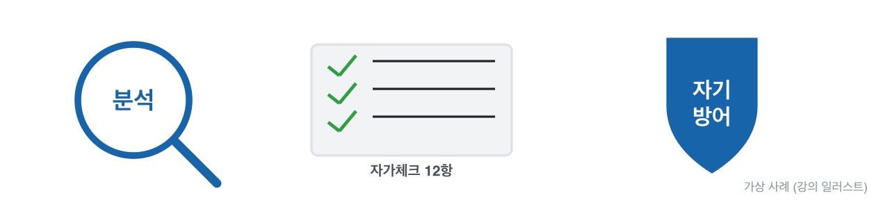

강의 분량

1,904줄

변칙 사례

132건+

시간선 패턴

9패턴

<small class="meta">100M1S · 매매자 자기방어 강의</small>

---

● 100M1S

SLIDE 1 · INTRO

# 부록 G 매트릭스 — **12 사례 × 9 패턴**

> 각 셀 = 해당 사례의 변칙이 본 패턴에 위치하는 빈도. ✓✓ = 다수 / ✓ = 1~2건 / 빈칸 = 미매핑.

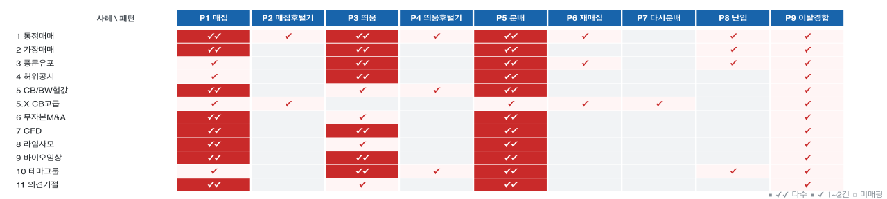

**매매 정수**: P3 띄움 = 눌림매매·돌파매매 진입 핵심 / P5 분배 = 진입 절대 금지 + 청산만 / P9 이탈경합 = 5호가 양방향 두께 = 진입 보류

---

● 100M1S

SLIDE 2 · CASE 1 · 통정매매 (Wash Trade)

# **사례 1** — 보이지 않는 핑퐁

> **가상 사례 (㈜A 모델)** — 통정매매 행태 관찰
> D-90 K급 주포가 차명 5계좌(평균 3,000만원/계좌)로 ㈜A 시총 600억 코스닥 종목을 1.5억으로 분할 매집하는 행태가 관찰된다.
> D-30. 5분봉 거래량 평소 ×8, 거래대금 50억 → 380억. 통정매매 ×3회/일 식별.
> D-7 16:30 호재 공시 + 익일 +28% 갭상승 + D+1 분할매도 시작.

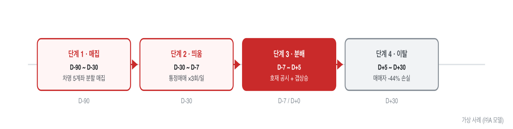

시총·평균매집가

600억 / 3,000원

D-7 종가

8,400원 +180%

K 차익

+45억

세력 행태 (관찰)
"거래대금 ×7 폭증 = 큰 호재" 추격매수 → D+1 갭상승 매수가 11,000원 → D+5 종가 6,200원 → <strong>-44% 손실</strong>

매매자 인지·대응
2막 후반 첫 윗꼬리 → 1분봉 RSI 30 → MA20 터치 → <strong>대표 동행 진입</strong> (분봉 스캘핑, 손절 -3%)

매매 원칙
패턴 3 (띄움) 첫 윗꼬리 직후 = <strong>눌림매매 진입 후보</strong> (변칙 2-2 윗꼬리 후 RSI 30 신호). 통정매매 ×3회/일 + 거래원 분포 변화 식별 시 패턴 5 분배 임박 = 즉시 청산.

D-90 매집D-30D-7 띄움D+0 분배D+30D+90 이탈

---

● 100M1S

SLIDE 3 · CASE 2 · 가장매매 (Pre-arranged Trade)

# **사례 2** — 혼자 치는 핑퐁

> **가상 사례 (㈜B 모델)** — 가장매매 단독 행위주체 관찰
> J(38, 단독 작전수)가 HTS 8대 + 8 차명계좌 운영. ㈜B 시총 200억 저시총 코스닥에서 5분봉 1회 자기매매로 거래량 ×8 폭발을 위장하는 행태가 관찰된다.
> D-20 호가 페인팅: 매수 잔량 30초 내 70% 취소 ×40회. 매매자가 호가창 두께를 보고 추격하는 시점.
> D-2 09:30 텔레그램방 "오늘 마감 직전 상한가 갑니다" 풍문 → 11:00 매매자 추격매수 절정 → 11:30 분배 시작.

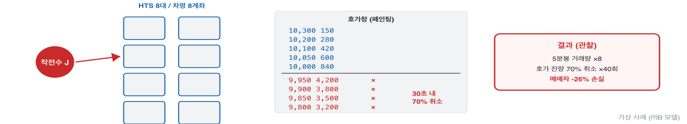

HTS·차명

8대 / 8계좌

5분봉 거래량

평소 ×8

텔레그램 외주

월 200만원

세력 행태 (관찰)
호가 두께 + 5분봉 거래량 ×8 = "거래량 폭발 호재" 추격 → 11:30 분배 시작 시점 매수가 평균 9,800원 → 종가 7,200원 <strong>-26%</strong>

매매자 인지·대응
호가 잔량 30초 70% 취소 ×5회 = <strong>-15 페널티</strong> + 진입 차단. 5분봉 ×8 단독 = -10 + 게이트 차단 (PM320)

매매 원칙
사례 2는 매집 단계 식별 = <strong>HTS 8대 동일 IP 클러스터 적발</strong>로만 활용 (사후). 진입 영역 0. 텔레그램 유료방 신규 가입 폭증 + 종목 노출 = 풍문 작전 의심 → 패턴 3 (띄움) 직격 회피.

D-60 매집D-20 띄움D-2 풍문D+0 분배D+30

---

● 100M1S

SLIDE 4 · CASE 3 · 풍문 유포형 (디지털 군중 동원)

# **사례 3** — 텔레그램 리딩방 + 카페 알바 12명

> **가상 사례 (㈜Q 모델)** — 풍문 유포 인프라 관찰
> 풍문책 N(41, 전직 증권사 RA)이 텔레그램 유료방 3개 + 무료방 12개 운영. 월 99만원 ×800명 = 매출 8억 규모의 행태가 관찰된다.
> N의 카페 알바 12명, 시간당 1만원, 1인 일 30~50건 게시·댓글. 동일 IP 회피 위해 카페별 1~2명 분담.
> D-1 12:00:00 N의 유료방 3개 동시: "㈜Q 주목. 다음 작전 대장. 종목코드 XXXX." + 12:01 카페 알바 12명 동시 게시: "AI 자회사 설립 임박, 친구가 IR쪽이라 들었음." (동조성 게시 패턴)

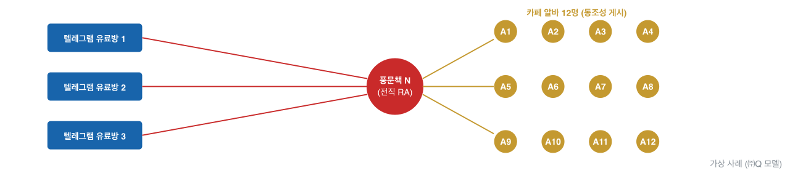

유료방 회원

800 → 2,400명

알바 게시량

일 47건 (동조성 80%+)

작성자 다양성

≤ 5명

세력 행태 (관찰)
"카페에서 다들 추천하는 종목" 인식 → 후기 위장글 ("어제 +30%") 보고 추격매수 → D+1 09:30 N 컷오프 + 알바 키워드 중지 → 종가 -18%

매매자 인지·대응
<strong>카페 작성자 다양성 ≤ 5명 + 거래대금 폭증 = 풍문 작전 = 진입 금지</strong>. 텔레그램 유료방 신규 가입 1주 ×3 = 풍문 채널 본진 의심 → -20 페널티

매매 원칙
이시카와 영역 직격: 풍문 채널 다양성 메트릭 + 동일 시점 거래대금 동조 식별 → PM320 게이트 차단. 매매자는 <strong>차트만 본다</strong> (카페·텔레그램 후기 0% 신뢰). 패턴 3 (띄움)·패턴 5 (분배 직전) 모두 회피.

D-60 인프라D-30 풍문D-1 절정D+0 분배D+1 컷오프

---

● 100M1S

SLIDE 5 · CASE 4 vs CASE 9 · 차별 분석

# **사례 4 (허위공시)** vs **사례 9 (바이오 임상)**

> 표면 동일 시퀀스 ("장 마감 후 16:30 공시 + 익일 시초가 +30% + 분할매도") = Jaccard 0.40 → **차별 12축**으로 해소.

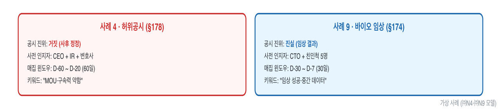

| 차별 축 | 사례 4 (허위공시) | 사례 9 (바이오 임상) |
|---|---|---|
| **공시 진위** | 거짓 (사후 정정) | 진실 (임상 결과) |
| **법조 위험** | §178 부정거래 (사기적 부정거래) | §174 미공개정보 이용 |
| **사전 인지자** | CEO + IR + 변호사 (거짓 인지) | CTO + 친인척 5명 (사실 인지) |
| **매집 윈도우** | D-60 ~ D-20 (60일) | D-30 ~ D-7 (30일, 임상 종료~공시) |
| **부풀림 키워드** | "MOU·양해각서·구속력 약함" | "임상 성공 가능성·중간 데이터" |
| **D-day 메커니즘** | 공시 후 사실 변경 X (D+30 정정) | 공시 후 사실 확정 (정정 무관) |
| **반환 가능성** | 부당이득 환수 가능 | 차익 환수 불가 (사실 공시) |
| **회피 식별** | "MOU 호재" 카페 폭증 | 임상 종료 ~ 공시 거래대금 ×5 |

세력 행태 (양 사례 공통)
"분기 매출 +52% YoY" 또는 "임상 성공 임박" 풍문으로 매매자 추격 유인 → 익일 갭상승 +30% → D+5 분할매도 절정 → 종가 -45% 손실 분배

매매자 인지·대응 (각 사례별)
사례 4: 공시 본문 "구속력 없음" 키워드 = 진입 차단 
사례 9: 임상 종료~공시 윈도우 거래대금 ×5 = -15 페널티

매매 원칙
양 사례 모두 <strong>16:00~17:30 공시 + 익일 갭상승 ≥ +20% = 진입 금지</strong>. 사례 9 친인척 분석 = 공정공시 §174 윈도우 직격. 사례 4 = §178 가담 위험.

---

● 100M1S

SLIDE 6 · CASE 5 · CB/BW 헐값 발행 (Q-046b PoC C 매칭)

# **사례 5** — 사채로 짓는 작전 (D-180 매집 시작)

> **가상 사례 (㈜D 모델)** — 사모 CB 인수 행위주체 관찰
> D-180 ㈜D 이사회 결의: 운영자금 100억 조달을 위한 사모 CB 발행. 인수자 ㈜S캐피탈로 식별된다.
> S가 100억으로 CB 200만주 분 인수 = 전환 시 시총 12% 확보. 전환가 5,000원, 현재가 6,200원 = 미실현 차익 즉시 +24% 구조.

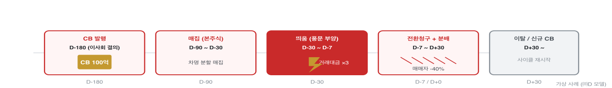

회사 시총

400억 코스닥

CB 발행

100억

전환가/현재가

5,000 / 6,200원 +24%

세력 행태 (관찰)
"운영자금 100억 = 정상 회사 활동" 오인 → DART CB 공시 미열람 → D-7 전환청구 후 D+30 분배 절정 매수 → -40%

매매자 인지·대응
<strong>CB 발행 공시 30일 윈도우 = 진입 차단 (-15 페널티)</strong>. 본주식 매집 + 풍문 부양은 별개 (D-90 ~ D-30 거래대금 ×2 + RSI ≤ 30 + CB 공시 30일 외 = 진입 후보)

매매 원칙
사례 5 = 11원칙 §7 "CB 종목 회피" 직격. <strong>전건 회피 (사용 0건)</strong>. 단, 본주식 매집 단계 (CB 공시 30일 외) + 거래대금 ×2 + 1분봉 RSI 30 + MA20 터치 = 분단위 스캘핑 진입 후보.

D-180 매집D-90 띄움D-7 전환청구D+30 분배D+60 이탈

**📍 본 슬라이드 HTML mockup**: `lab/poc-design-sample.html` (Q-046b PoC C 사례 5 단계 1)

---

● 100M1S

SLIDE 7 · CASE 6 · 무자본 M&A

# **사례 6** — 회사 돈으로 회사 사기

> **가상 사례 (㈜M 모델)** — 무자본 M&A 인수 행위주체 관찰
> D-90 인수자 ㈜H (자기자본 0, 사채 200억)가 ㈜M (시총 600억, 자산 250억) 경영권 인수 + 50% 프리미엄으로 진입.
> 인수 후 30일 자산 매각 → 사채 200억 상환 → 자기자본 0 무자본 M&A 확정 패턴.
> D-30 "신사업 진출" 공시 + 풍문 부양 → D-3 16:30 제3자배정 신주 공시 → D+0 분배 시점.

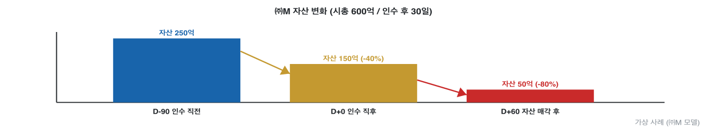

인수자 자기자본

0원 (사채 200억)

인수 프리미엄

+50%

D+60 자산

50억 -80%

세력 행태 (관찰)
"경영권 변경 = 신성장 호재" 매수 → "신사업 진출" 공시 + 거래대금 ×3 추격 → 제3자배정 신주 분배 → D+60 자산 -80% = <strong>폭락</strong>

매매자 인지·대응
<strong>인수자 설립 1년 미만 = 게이트 차단</strong>. DART 자산 처분 공시 30일 = 즉시 청산. 분기 자산 -50% = 즉시 시장가 청산

매매 원칙
사례 6 = "자기자본 0 인수" 검증 게이트 (G2+). DART 인수 공시 + 인수자 설립일 + 자기자본 SoT 매핑 의무. 패턴 3 (띄움) "신사업 + 거래대금 ×3" = 분단위 스캘핑 진입은 <strong>눌림 시에만 + 손절 -3%</strong>.

D-90 인수D-30 신사업D-3 제3자배정D+0 분배D+60 자산노출

---

● 100M1S

SLIDE 8 · CASES 7~10 · 합본

# **사례 7~10** — 핵심 변칙만

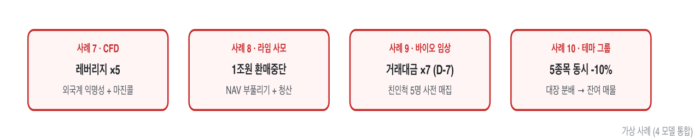

| 사례 | 핵심 메커니즘 | 대표 결정 (회피·진입) |
|---|---|---|
| **7 CFD SG증권** | CFD 익명성 + 5배 레버리지 매집 (2~3년 잠복) → 마진콜 = 8종목 동시 하한가 (2023.04.24~27 SG증권 사태 패턴) | **외국계 창구 ≥ 30% = 진입 금지**. 8종목 동시 -10% = 즉시 청산. G3 미만 절대 진입 X |
| **8 라임 사모펀드** | "사모 = 안전" 마케팅 1조원 모집 → 부실자산 +200% 매입 NAV 부풀리기 → 환매 중단 = 청산 시퀀스 | **사모펀드 시총 5%+ 보유 = 진입 금지**. DART 환매 중단 = 즉시 청산 + 영구 차단 |
| **9 바이오 임상** | CTO 사전 인지 + 친인척 5명 D-30 매집 → D-7 풍문 거래대금 ×7 → D-day 16:30 임상 결과 공시 → D+1 09~11 분배 | **임상 종료~공시 거래대금 ×5 = -15**. 임상 결과 공시 16:00~17:30 = 익일 진입 금지 |
| **10 테마 그룹** | 테마 5종목+ 매집 + 통합 마케팅 동시 부양 → 대장 분배 → 2~3등 매물 → 동시 -10% 사망 | **거래대금 1등 (대장)만 진입**. 테마 5종목 동시 -10% = 즉시 청산. 다음 테마 Rotation 추적 |

매매 원칙 (4 사례 통합)
사례 10 = <strong>거래대금 1등 대장 진입 영역</strong>. 사례 7·8·9 = 전건 회피. 공통 회피 = <strong>"외국계 창구 비중 + 사모펀드 보유 + 임상 윈도우" 3축 검증</strong>.

---

● 100M1S

SLIDE 9 · CASE 11 · 회계감사 의견거절

# **사례 11** — 재무제표 신뢰 붕괴

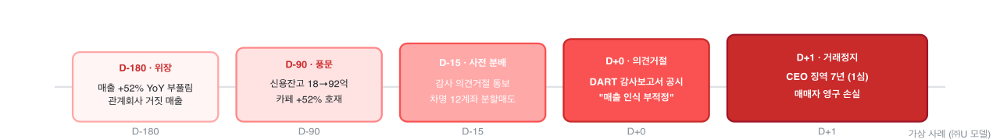

> **가상 사례 (㈜U 모델)** — 회계 부정 + 사전인지 분배 행태 관찰
> 현장 대화 기록 (가상): "D-180 CEO U + CFO 합의 — 다음 분기 매출 +50% 부풀려서 표시. 관계회사 ㈜W2와 거짓 매출 거래 100억. 외부 감사 통과 가능 수준."
> 차명 12계좌로 D-180 ~ D-90 매집 60만주, 평균 13,000원 패턴.
> D-15 외부 감사인 의견거절 검토 통보 → CEO 사전 인지 → 차명 12계좌 분할매도 시작 = **사전 통보 분배 절정** 행태.
> D+0 16:30 DART 감사보고서 공시: "관계회사 매출 인식 부적정 = **의견거절**". D+1 09:00 거래정지.

매출 위장

+52% YoY (실제 +0%)

신용잔고

18억 → 92억 +411%

사후 1심

CEO 징역 7년

세력 행태 (관찰)
"분기 매출 ×1.5 호재" 카페 폭증 + 사모펀드 신규 진입 보고 추격 → D-15 거래대금 폭증을 "조정 매수 기회" 인식 → D+1 거래정지 = <strong>영구 손실</strong>

매매자 인지·대응 (회피만)
<strong>관계회사 매출 비중 ≥ 30% = -15 / 재고회전율 ×2 악화 = -10 / 감사인 변경 1년 + 매출 +50% YoY = -20 / 감사 의견 한정·의견거절·부적정 = 진입 차단 게이트 + 영구 차단</strong>

매매 원칙
사례 11 = <strong>회피만 (시드 0%, 진입 권한 0)</strong>. 재무제표 신뢰 붕괴 = 펀더멘털 자체 위험 = 영구 회피. 모든 의견거절이 작전은 아니므로, 매매자 자기방어 회피 가이드로만 활용한다.

D-180 위장D-90 풍문D-30 감사D-15 사전분배D+0 의견거절D+1 거래정지

---

● 100M1S

SLIDE 10 · CB §5.X · 고급 패턴

# **CB 고급 §5.X** — 리픽싱 + 풋옵션 무한 사이클

> **개념 정의** — CB 고급 메커니즘
> 리픽싱(Refixing): 주가 하락 시 전환가 자동 하향 조정. 한도 70% (공격적) = 발행가의 30%까지 전환가 인하 가능.
> 풋옵션(Put Option): CB 보유자가 만기 전 원금+이자 청구권. 세력 행태 = 본주식 분배 + 풋옵션 차익 + 신규 CB 인수 = **무한 사이클** 구조.

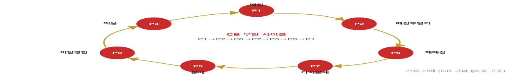

| 변칙 (6건) | 메커니즘 | 식별 신호 | 패턴 매핑 |
|---|---|---|---|
| 리픽싱 한도 70% (공격적) | 발행 시점 하락 비대칭 차익 사전 확보 | DART CB 조건 70% 한도 | P1 (매집) |
| 1회차 리픽싱 발동 | 주가 -30% → 전환가 자동 인하 | 1회차 리픽싱 공시 | P2 (매집후털기) |
| 1회차 후 부양 | 인하된 전환가 기준 추가 차익 확보 | 거래대금 ×3 + 풍문 재가속 | P6 (재매집/재띄움) |
| 2회차 리픽싱 | 추가 하락 → 전환가 추가 인하 | 2회차 리픽싱 공시 | P7 (다시 분배) |
| 풋옵션 행사 1주 전 풍문 | "사채 상환 호재" 추격매수 유인 | 카페 "사채 상환" + 풋옵션 D-7 | P5 (분배) |
| **풋옵션 + 신규 CB 인수** | 무한 사이클 시작 | 신규 CB 발행 공시 + 30일 회피 | P9 → P1 (재매집) |

세력 행태 (관찰)
"1회 사이클 분석 = 다음 사이클 진입 가능" 오인 → 리픽싱 후 부양에 추격 → 풋옵션 행사 시점 분배 폭격 → 신규 CB 발행 시 다시 매집 단계 진입 = <strong>무한 손실</strong>

매매자 인지·대응
<strong>신규 CB 발행 공시 = 새 사이클 매집 시작 = 다시 30일 회피</strong>. 풋옵션 D-7 카페 풍문 = 진입 금지. 리픽싱 한도 70% = -10 페널티 + 30일 회피

매매 원칙
사례 5.X = 11원칙 §7 직격 + 무한 사이클 함정. <strong>CB 종목 = 매집·재매집 모든 시점 회피</strong>. 다음 사이클 진입 0%. 리픽싱·풋옵션 메커니즘 = 식별 + 영구 차단 게이트.

---

● 100M1S

SLIDE 11 · 부록 G 매트릭스 · 패턴별 우선순위

# **9패턴 우선순위** — 매매 직결 SoT

| 패턴 | 사례 수 | 매매 정수 매핑 | 우선순위 |
|---|---|---|---|
| **P1 매집** | 12/12 | 식별 후 진입 가능 (펀더멘털 OK 시) | 중간 (대표 = 매집 단계 진입 X, 식별만) |
| **P2 매집 후 개미털기** | 2/12 | 4축 score ≥ +4 + 양봉 전환 → G2+ 동행 | 낮음 (G1 금지) |
| **P3 띄움** | **11/12** | <strong>눌림매매 스윙 + 분단위 스캘핑 진입 핵심 영역</strong> (변칙 2-2 윗꼬리 후 RSI 30 / 2-3 아랫꼬리 / 2-4 대장만) | **최고 (진입 본질)** |
| **P4 띄움 후 개미털기** | 4/12 | 첫 윗꼬리 직후 RSI 30 + MA20 터치 = 진입 후보 | 높음 |
| **P5 분배** | **12/12** | <strong>진입 절대 금지 + 청산만</strong> (변칙 3-1~3-7 분배 7건 = 회피) | **최고 회피 영역** |
| **P6 재매집/재띄움** | 2/12 | D+90 후 새 사이클 진입 후보 | 중간 |
| **P7 다시 분배** | 1/12 | 회피 (희귀) | 낮음 |
| **P8 다른 세력 난입** | 4/12 | 거래원 분포 변화 식별 = 새 사이클 신호 | 중간 (G2+) |
| **P9 이탈 + 세력 경합** | **12/12** | <strong>5호가 양방향 두께 = 진입 보류</strong> | 회피 |

강력 강조: 패턴 1·3·5·9
<strong>P1 (매집) = 식별 / P3 (띄움) = 진입 본질 / P5 (분배) = 회피 본질 / P9 (이탈경합) = 진입 보류</strong>. 12 사례 전체 ✓✓ = 4 패턴 = <strong>매매 의사결정 90% 차지</strong>. 
<strong>본인 파동 × 세력 파동 = 교집합 = 수익구간</strong>. 세력에게 놀아나는 매매자의 반대 = 세력의 관점 = 매매자의 진입.

---

● 100M1S

SLIDE 12 · 매매자 자가체크리스트 + 결론

# **자가체크리스트** — 매매 진입 직전 5분

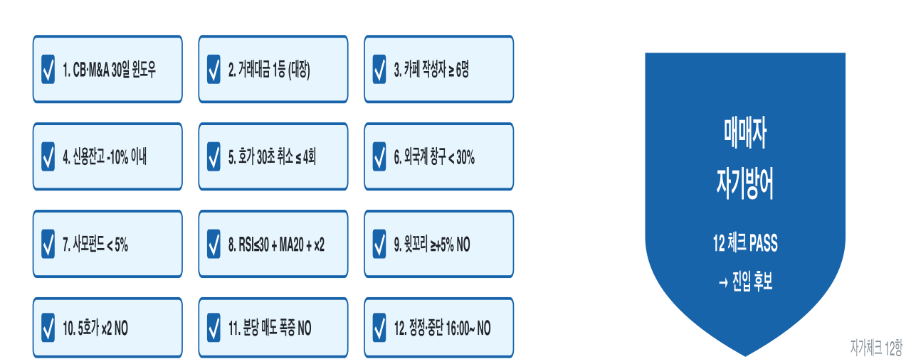

| # | 체크 항목 | PASS 조건 | 패턴 매핑 |
|---|---|---|---|
| 1 | DART CB·BW·M&A·감사 의견 공시 30일 윈도우 | 윈도우 외 | P1 회피 |
| 2 | 거래대금 1등 (대장)인가 | 1등 (테마 5종목 ↑ 시) | P3 진입 |
| 3 | 카페 작성자 다양성 ≥ 6명 | 6명 이상 | P3 회피 |
| 4 | 신용잔고 1주 변화 | -10% 이내 | P3·P5 경계 |
| 5 | 호가 잔량 30초 70% 취소 빈도 | ≤ 4회 | P3 진입 |
| 6 | 외국계 창구 비중 | < 30% | P1·P3 진입 |
| 7 | 사모펀드 시총 비중 | < 5% | P1 진입 |
| 8 | 1분봉 RSI ≤ 30 + MA20 터치 + 거래대금 ×2 | 3축 동시 | **P3 진입 신호** |
| 9 | 윗꼬리 ≥ +5% + 종가 -3% | NO (있으면 청산) | P5 회피 |
| 10 | 5호가 매수 두께 vs 매도 두께 | 매수 ≥ 매도 ×2 NO (의심) | P5·P9 회피 |
| 11 | 분당 매도 폭증 + 가격 -3% 미만 유지 | NO (있으면 분배 진행) | P5 회피 |
| 12 | DART 정정·환매중단·의견거절·임상결과 16:00~17:30 공시 | 없음 | P5·P9 영구 차단 |

세력 vs 매매자 양면 박스 12건 요약
사례 1·2·3·4·5·5.X·6·7·8·9·10·11 = <strong>세력 행태 12건 + 매매자 인지·대응 12건 + 매매 원칙 12건</strong>.

변칙 분류 4축
<strong>"세력 동행 진입 / 매매자 함정 / 관찰 / 미경험"</strong> 4축 분류로 매매자가 자기 위치를 항상 식별한다.

결론 — 매매자의 자기방어 체크리스트
세력은 매집 → 띄움 → 분배 → 이탈을 반복하는 행태가 관찰된다. 매매자가 함정에 빠지는 이유는 이 4단계 흐름을 인지하지 못하기 때문이다. <strong>본인 파동 × 세력 파동 = 교집합 = 수익구간</strong>. P3 (띄움) 진입 + P5 (분배) 청산만 한다. 패턴 1·5·9는 12/12 사례 전체 = 매매 의사결정 90% 차지. 
<strong>"세력 행태를 인지하는 만큼 매매자는 함정을 회피하고, 세력 수익 구간을 역으로 추출할 수 있다."</strong>

---

<!-- _class: legal -->
<!-- _paginate: false -->

● 100M1S

# **LEGAL · DISCLAIMER**

본 자료는 **100M1S 비공개 연구 자료**입니다.

1. 본 자료는 **교육·연구 목적** 작성된 비공개 자료로 외부 유포·공유·2차 가공·언론 인용 모두 금지됩니다.
2. 본 자료의 사례(작전 패턴 분석)는 시장에서 관찰된 패턴을 일반화한 것으로, **특정 종목·특정 인물·특정 사건을 지칭하지 않습니다**. 모든 종목명·회사명·인명은 가상입니다.
3. 본 자료는 **투자 권유·투자 자문이 아닙니다**. 본 자료를 근거로 투자 결정 시 발생하는 모든 손실은 투자자 본인 책임입니다.
4. 본 자료의 기법·신호·진입 시점은 검증된 알파를 보장하지 않으며, 시장 환경에 따라 작동하지 않을 수 있습니다.
5. 본 자료의 시세조종 패턴 식별은 **자기방어 목적**이며, 동일 패턴을 모방·실행하는 행위는 **자본시장법 §176, §178 위반으로 형사처벌 대상**입니다.

---

**의심 사례 신고**: 한국거래소 1577-0088 / 금감원 1332

<small class="meta">100M1S · 비공개 연구자료</small>

<!-- ================================================================================ -->
<!-- LEGAL P0-4 EXCLUDE BLOCK — source-only mirror (slide 본문 인용 0건)              -->
<!-- EDU-002 v0.2.1-bis 9쌍 marker 본문 source 보존 (DSN-003 §12.4 + §13.4 정합).      -->
<!-- 빌드 시 marker 사이 콘텐츠 sed 사전 제거 (Marp .pptx/.pdf/.html 모두 인용 0건).   -->
<!-- 명령: sed -e '/LEGAL_P0_4_EXCL_START/,/LEGAL_P0_4_EXCL_END/d' (실제 패턴은 hyphen) -->
<!-- ================================================================================ -->

[case 3 — 텔레그램·카페 알바 풍문 작전]
<!-- LEGAL-P0-4-EXCLUDE-START -->
### 매매자 자기방어 가이드

- **회피·관찰 우선**: 풍문 단계 (D-15 ~ D-7) 카페 게시 ≥ 평소 ×15 + 작성자 다양성 5명 미만 = **풍문 작전 의심 윈도우 → 진입 금지**
- 진입 검증 조건: 작성자 다양성 ≥ 10명 + 후속 검증 가능 IR 출처 + 거래대금 ≥ 200억 + 1분봉 RSI ≤ 30 동시 충족
- 강제 청산: "MOU/양해각서/추후 협의/구속력 없음" 키워드 공시 발견 즉시
- 비중: 시드 3% (풍문 작전 의심 종목 보수적)
<!-- LEGAL-P0-4-EXCLUDE-END -->

[case 4 — 허위공시 작전]
<!-- LEGAL-P0-4-EXCLUDE-START -->
### 매매자 자기방어 가이드

- **회피·관찰 우선**: 풍문 단계 (D-15 ~ D-7) 거래대금 ≥ 200억 + 본 계약 키워드 공시 0건 = **작전 의심 윈도우 → 진입 금지**
- 진입 검증 조건: 거래대금 ≥ 200억 + 1분봉 RSI ≤ 30 + MA10 터치 + 미공개정보 누출 신호 부재 (친인척 매수 공시 0건 + 공시 직전 거래량 평소 ×3 미만) 동시 충족
- 강제 청산: "MOU/양해각서/검토중" 키워드 공시 발견 즉시
- 비중: 시드 5% (허위공시 위험)
<!-- LEGAL-P0-4-EXCLUDE-END -->

[case 5 — CB/BW 헐값 발행]
<!-- LEGAL-P0-4-EXCLUDE-START -->
### 매매자 자기방어 가이드
- 진입 조건: 거래대금 ≥ 평소 ×2 + 1분봉 RSI ≤ 30 + 종가 = MA20 ±1% + CB 공시 30일 외
- 청산 조건: 익절 = 직전 5일 고점 / 손절 = 진입가 -3% / 강제 청산 = 전환청구 공시 즉시
- 비중: 시드 10%
<!-- LEGAL-P0-4-EXCLUDE-END -->

[case 6 — 무자본 M&A]
<!-- LEGAL-P0-4-EXCLUDE-START -->
### 매매자 자기방어 가이드
- 진입 조건: 거래대금 ≥ 평소 ×3 + 1분봉 RSI ≤ 30 + 인수자 자금 출처 명확 + 인수 후 30일 경과
- 청산 조건: 익절 = +5% / 손절 = -3% / 강제 청산 = 자산 처분 공시 즉시
- 비중: 시드 5% (무자본 M&A 의심 종목 보수적)
<!-- LEGAL-P0-4-EXCLUDE-END -->

[case 7 — CFD SG증권형]
<!-- LEGAL-P0-4-EXCLUDE-START -->
### 매매자 자기방어 가이드
- 진입 조건: CFD 비중 < 10% + 그룹 동조성 < 5% + 거래대금 ≥ 200억 + 1분봉 RSI ≤ 30 (눌림목)
- 청산 조건: 익절 = +5% / 손절 = -3% / 강제 청산 = 동일 그룹 5종목+ 동시 -10% 시 즉시
- 비중: 시드 3% (CFD 청산 트리거 위험)
<!-- LEGAL-P0-4-EXCLUDE-END -->

[case 8 — 사모펀드 라임형]
<!-- LEGAL-P0-4-EXCLUDE-START -->
### 매매자 자기방어 가이드
- 진입 조건: 사모펀드 보유 < 5% + 환매 이슈 0건 + 거래대금 ≥ 200억
- 청산 조건: 익절 = +5% / 손절 = -3% / 강제 청산 = 펀드 환매 중단 공시 즉시
- 비중: 시드 5%
<!-- LEGAL-P0-4-EXCLUDE-END -->

[case 9 — 바이오 임상 미공개정보]
<!-- LEGAL-P0-4-EXCLUDE-START -->
### 매매자 자기방어 가이드 (임상 미공개정보 윈도우 외 한정)

- **회피·관찰 우선**: 임상 종료~공시 사이 D-30~D-day 윈도우 = **진입 금지**. 본 윈도우 거래대금 폭증 = §174 의심 신호 → 매매 가담 위험
- 진입 검증 조건 (윈도우 외 한정): 임상 결과 공시 후 D+30 이후 + 거래대금 ≥ 200억 + 1분봉 RSI ≤ 30 + 친인척 매수 공시 0건 + 후속 임상 실패 신호 부재 동시 충족
- 강제 청산: 임상 결과 공시 직전 일봉 윗꼬리 시 + 친인척 매수 공시 발견 즉시
- 비중: 시드 3% (바이오 변동성 위험)
<!-- LEGAL-P0-4-EXCLUDE-END -->

[case 10 — 테마 그룹 동시 작전]
<!-- LEGAL-P0-4-EXCLUDE-START -->
### 매매자 자기방어 가이드
- 진입 조건: 테마 대장(거래대금 1등) + 거래대금 ≥ 300억 + 1분봉 RSI ≤ 30 + 테마 5종목 동시 폭증 단계 아님
- 청산 조건: 익절 = +5% / 손절 = -3% / 강제 청산 = 테마 5종목 동시 -10% 시 즉시 (테마 사망)
- 비중: 시드 10% (대장만 진입 시 가장 안정적)
<!-- LEGAL-P0-4-EXCLUDE-END -->

[case 11 — 회계감사 의견거절·한정·강조사항]
<!-- LEGAL-P0-4-EXCLUDE-START -->
### 매매자 자기방어 가이드

- **회피·관찰 우선**: 감사 보고서 작성 단계 (D-15 ~ D-7) 거래대금 폭증 + 신용잔고 감소 = **사전 통보 분배 의심 윈도우 → 진입 금지**. 감사 의견거절 윈도우 사전 통보 분배 의심 = §174 미공개정보 가담 위험
- 진입 검증 조건: 감사 보고서 발표 후 **거래정지 해제 + 적정 의견 + 관계회사 매출 비중 < 20% + 재고회전율 정상화** 동시 충족
- 강제 청산: DART 감사 의견 "한정/의견거절/부적정/계속기업 불확실" 공시 발견 즉시
- 비중: 시드 0% — **재무제표 신뢰 붕괴 = 펀더멘털 자체 위험 = 영구 회피**
<!-- LEGAL-P0-4-EXCLUDE-END -->

<!-- ================================================================================ -->
<!-- END LEGAL P0-4 EXCLUDE BLOCK                                                     -->
<!-- ================================================================================ -->
