<!-- _class: lead -->
<!-- _paginate: false -->
<!-- _footer: '' -->
<!-- _backgroundColor: '#0A2540' -->
<!-- _color: '#FFFFFF' -->

100M1S

# 세력 추적

## 한국 코스닥 작전주 12 사례 + 기관·연기금 분배 전략 분석

<!-- v0.8 자극 부제 폐기 (DSN-20260506-001 §6, 대표 catch 2026-05-06 00:12 KST) -->

V 0.9 · 2026-05 · 100M1S RESEARCH

---

Table of Contents · Part 1

# 목차

Part 1

작전주 12 사례

<ul class="toc-list">
<li>01통정매매 (a/b/c)04</li>
<li>02가장매매 (a/b)07</li>
<li>03풍문 유포 (a/b)09</li>
<li>04허위공시 (a/b)11</li>
<li>05CB/BW (a/b)13</li>
<li>5.X리픽싱15</li>
</ul>

&nbsp;

&nbsp;

<ul class="toc-list">
<li>06무자본 M&amp;A (a/b/c)16</li>
<li>07CFD 익명19</li>
<li>08사모펀드20</li>
<li>09임상 미공개 (a/b/c)21</li>
<li>10테마 작전24</li>
<li>11회계 부정 (a/b/c)25</li>
</ul>

---

Table of Contents · Part 2 · Appendix

# 목차

Part 2

기관·연기금 7 사례

<ul class="toc-list">
<li>I-1VWAP / TWAP29</li>
<li>I-2블록딜30</li>
<li>I-3다크풀31</li>
<li>I-4시간외 단일가32</li>
<li>I-5분산 분배33</li>
<li>I-6패시브 리밸런싱34</li>
<li>I-7외인 BU/SE35</li>
</ul>

Appendix

LEGAL · DISCLAIMER

<ul class="toc-list">
<li>36자본시장법 §174 / §176 / §17836</li>
</ul>

---

<!-- _class: case -->

CASE 01
작전주 12 사례

Mechanism
통정매매 (Wash Trade)
Timeline
D-90 ~ D+30
Statute
자본시장법 §176-1 §443 가중처벌

# 보이지 않는 핑퐁

## 차명 12계좌 시드 360억 분할 매집 + 호재 갭상승 + 분할매도

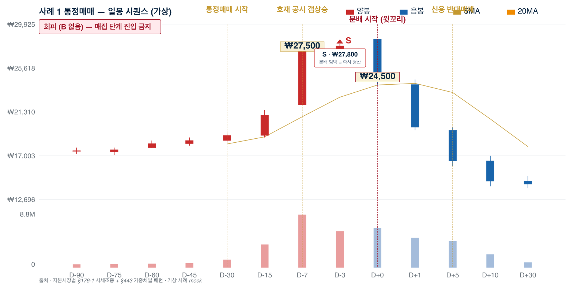

일봉 시퀀스 — D-90 매집 ~ D+30 청산 (가상 사례 mock · §176-1 + §443)

<h3>세력 전략</h3>

㈜A 시총 1,800억 코스닥. 차명 12계좌 시드 360억 분할 매집 → D-7 호재 공시 + 익일 +12% 갭상승 → D+1 분할매도 = 차익 +1,180억 / §443 가중처벌 7년+

<h3>매매자 동행</h3>

2막 후반 첫 윗꼬리 + 1분봉 RSI 30 + MA20 터치 = 분봉 스캘핑 진입 (손절 -3%). 통정매매 ×3회/일 식별 = 패턴 5 분배 임박 = 즉시 청산

---

<!-- _class: case -->

CASE 01 · 분석
Continued from p.4

Mechanism
§176-1 + §443
Sentence
7년 + 부당이득 5배
Seed → Profit
360억 → 1,180억 (+228%)

# 12 분산 매집 + 호가 페인팅

## 12 차명 분산 매집 → 호재 갭상승 → -19% 폭락

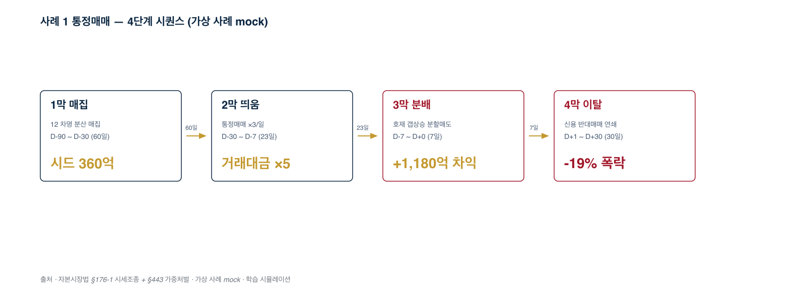

<table style="width:100%; border-collapse: collapse; margin-top: 8px; font-size: 16px;">
<thead><tr style="border-bottom: 1.5px solid #0A2540;"><th style="text-align:left; padding: 6px 8px;">단계</th><th style="text-align:left; padding: 6px 8px;">핵심 변칙</th><th style="text-align:left; padding: 6px 8px;">정량</th></tr></thead>
<tbody>
<tr style="border-bottom: 1px solid #DEE2E6;"><td style="padding: 4px 8px;"><strong>1막 매집</strong></td><td style="padding: 4px 8px;">12 차명 분산</td><td style="padding: 4px 8px;">시드 360억 / 60일</td></tr>
<tr style="border-bottom: 1px solid #DEE2E6;"><td style="padding: 4px 8px;"><strong>2막 띄움</strong></td><td style="padding: 4px 8px;">통정매매 ×3/일</td><td style="padding: 4px 8px;">거래대금 ×5 / VI ×3</td></tr>
<tr style="border-bottom: 1px solid #DEE2E6;"><td style="padding: 4px 8px;"><strong>3막 분배</strong></td><td style="padding: 4px 8px;">호재 갭상승 분할매도</td><td style="padding: 4px 8px;">차익 +1,180억</td></tr>
<tr><td style="padding: 4px 8px;"><strong>4막 이탈</strong></td><td style="padding: 4px 8px;">신용 반대매매</td><td style="padding: 4px 8px;">-19% / 5일 누적</td></tr>
</tbody>
</table>

행위주체 K급 주포(시드 360억) · 외주 알바 35명 · 자금책 X (D+180 사후 적발) · 가상 사례 mock

---

<!-- _class: case -->

CASE 01 · 동행
Continued from p.5

진입 후보
2막 후반 (D-15~D-10)
회피 시그널
3막 D-3 갭상승 직후
절대 회피
D+1 신용 반대매매

# 세력 전략 vs 매매자 동행

## 양면 분석 + 진입 시점 + 회피 시그널

<h3>세력 전략 (K)</h3>

분산 매집으로 노출 회피 (12 IP 클러스터 사후 적발). 통정매매 ×3/일로 거래량 페인팅 (정상 매매 위장). 호재 공시 갭상승 직후 분배 (개미 추격 흡수). 신용 반대매매 의도 유도 (D+1 -15% 종가 유지).

<h3>매매자 동행 (PM320)</h3>

<strong>진입</strong>: 2막 후반 D-15~D-10 일봉 거래대금 200억+ + 1분봉 RSI 과매도 눌림 = 눌림매매 스윙. <strong>회피</strong>: 3막 D-3 09:00 갭상승 직후 1분봉 첫 RSI 70 + 매도잔량 얇음 = 5분 스캘핑 익절. <strong>절대 회피</strong>: D+1 이후 신용 반대매매 시작 = 종목 사망 (대표 §7).

<blockquote style="margin-top: 16px; border-left: 3px solid #C49930; padding-left: 16px;">
<strong>매매 원칙</strong>: RSI 70 돌파 + MA20 ±1% 이탈 + 거래대금 평소 ×3 + 5호가 매도잔량 ≥ 매수잔량 ×3 = 즉시 시장가 청산 (슬리피지 감수)
</blockquote>

자본시장법 §176-1 시세조종 + §443 가중처벌 (50억+ → 무기/7년+, 5배 부당이득) · 부당이득 1,180억 → 100억+ 구간 = 무기/7년 영역 · 본 자료의 모든 가격·거래량·인물은 학습 목적 가상 시뮬레이션

---

<!-- _class: case -->

CASE 02
작전주 12 사례

Mechanism
가장매매 (Pre-arranged)
Timeline
D-60 ~ D+30
Statute
자본시장법 §176-2 호가 페인팅

# 혼자 치는 핑퐁

## HTS 8대 + 차명 8계좌 단독 행위 + 호가 페인팅

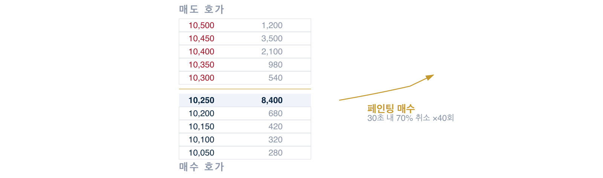

출처 · 호가창 mockup — §176-2 시세조종 패턴 (가상 사례)

<h3>세력 전략</h3>

㈜B 시총 200억. J 단독 작전수가 HTS 8대 + 차명 8계좌로 5분봉 거래량 ×8 위장 + 호가 페인팅 + 텔레그램 풍문 → 11:30 분배가 9,800원 / 종가 7,200원 -26%

<h3>매매자 동행</h3>

호가 잔량 30초 70% 취소 ×5회 + 5분봉 ×8 단독 = PM320 게이트 차단 + -25 페널티. 텔레그램 유료방 신규 가입 폭증 + 종목 노출 = 풍문 작전 직격 회피

---

<!-- _class: case -->

CASE 02 · 분석
Continued from p.7

Mechanism
§176-2 가장매매
Seed → Profit
27억 → 30억
Sentence
5년 + 부당이득 5배

# 1인 다계좌 vs 호가창 검증

## 동일 IP 클러스터 + 페인팅 + 점심 분배

<h3>세력 전략</h3>

1인 8 HTS 동시 운영 + 동일 IP 클러스터 (사후 적발 신호) + 호가 페인팅 (30초 70% 취소 ×5회) + 점심시간 11:30~14:00 분배 가속. 5분봉 거래량 ×8 위장 = 정상 매매 인지 유도. 텔레그램 유료방 풍문 동시 송출 = 추격매수 형성.

<h3>매매자 동행</h3>

<strong>스푸핑 신호</strong>: D-15 페인팅 후 매수잔량 한 번에 사라지면 즉시 매도. <strong>점심 분배 의심</strong>: 점심시간 분당 거래량 평소 ×3 = 분배 진행. <strong>청산 신호</strong>: 시간외 거래량 ↑ + 정규장 종가 -3% = 익일 갭하락 예고.

<blockquote style="margin-top: 16px; border-left: 3px solid #C49930; padding-left: 16px;">
<strong>매매 원칙</strong>: 5호가 매수잔량 30초 70% 취소 ×5회 + 점심 분당 거래량 ×3 = 즉시 시장가 청산. 본 자료의 모든 가격·거래량·인물은 학습 목적 가상 시뮬레이션
</blockquote>

자본시장법 §176-2 가장매매 + §443 가중처벌 · 1인 다계좌 + 동일 IP = 사후 적발 핵심 트리거

---

<!-- _class: case -->

CASE 03
작전주 12 사례

Mechanism
풍문 유포 (디지털 군중)
Timeline
D-60 ~ D+1
Statute
자본시장법 §178 부정거래

# 텔레그램 + 카페 알바 35명

## 풍문 유포 인프라 + D-1 동시 유포 + D+1 컷오프

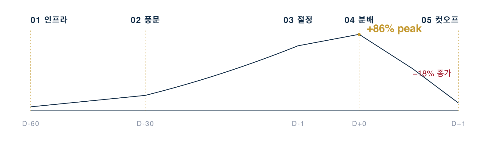

출처 · 텔레그램 유료방 + 카페 알바 풍문 작전 패턴 (가상 사례)

<h3>세력 전략</h3>

풍문책 N: 텔레그램 유료방 8개 (월 99만원 ×5,000명 = 50억) + 카페 알바 35명 (시간당 1만원, 일 30~50건) → D-1 12:00 동시 유포 → D+1 09:30 컷오프 → 종가 -18% / 1심 K 8년 + 부당이득 +760억 환수

<h3>매매자 동행</h3>

카페 작성자 다양성 5명 이하 + 거래대금 폭증 = 진입 금지. 텔레그램 유료방 신규 가입 1주 ×3 = 풍문 채널 본진 의심 (-20). 매매자는 차트만 본다

---

<!-- _class: case -->

CASE 03 · 분석
Continued from p.9

Mechanism
§178 부정거래
Seed → Profit
280억 → 800억+
Channels
텔레그램 8 + 카페 알바 35

# 12 변칙 + 풍문 채널 동조 검증

## 단일 키워드 동조 + MOU 위장 공시 + D+1 컷오프

<h3>세력 전략 (12 변칙)</h3>

단일 키워드 30채널 동조 송출 ("AI 헬스케어 대장주") + 공시 직전 24h 카페 평소 ×30 + MOU 양해각서 위장 공시 (구속력 없음) + 공시 직후 추가 풍문 가속 (잔여 분배 출구) + D+1 키워드 컷오프 (1주 ×30 → 0). 텔레그램 유료방 신규 회원 ×3 동조.

<h3>매매자 동행</h3>

<strong>풍문 의심</strong>: 카페 분류기 동일 키워드 폭증 + 작성자 다양성 5명 미만. <strong>분배 임박</strong>: 텔레그램 신규 회원 폭증 + 거래대금 ↑ 동시. <strong>분배 종료</strong>: 카페 키워드 1주 후 -100% = D+1 컷오프 신호.

<blockquote style="margin-top: 16px; border-left: 3px solid #C49930; padding-left: 16px;">
<strong>매매 원칙</strong>: 단일 키워드 30채널 동조 + 신규 회원 ×3 + 공시 본문 "MOU/양해각서" = 풍문 분배 윈도우 진입 금지 (-20 페널티). 본 자료의 모든 가격·거래량·인물은 학습 목적 가상 시뮬레이션
</blockquote>

자본시장법 §178 부정거래 (MOU 양해각서 결합 시 §178 + §176) · 8년형 + 부당이득 760억 환수 사례

---

<!-- _class: case -->

CASE 04
작전주 12 사례

Mechanism
허위공시 + 사후 정정
Timeline
D-60 ~ D+30
Statute
자본시장법 §178 사기적 부정거래

# 거짓 호재의 기술

## 거짓 공시 → 갭상승 → 분배 → 사후 정정 시퀀스

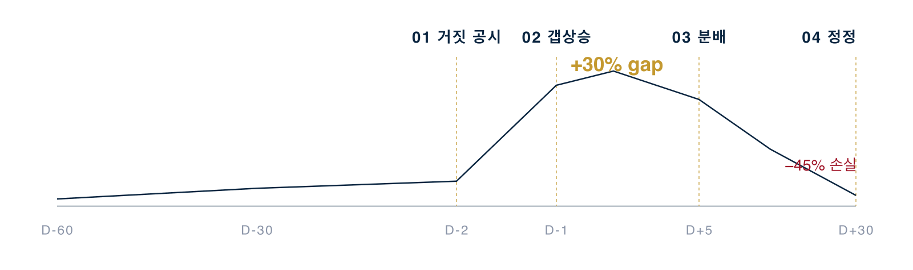

출처 · §178 사기적 부정거래 — 거짓 공시 + 정정 시퀀스 (가상 사례)

<h3>세력 전략</h3>

매집 D-60~D-20 + D-2 16:30 "분기 매출 +52% YoY" 거짓 공시 → D-1 시초가 +30% 갭상승 → D+5 분할매도 = -45% 손실 분배. D+30 정정 공시로 §178 직격

<h3>매매자 동행</h3>

공시 본문 "MOU/양해각서/구속력 없음" 키워드 = 진입 차단. 16:00~17:30 공시 + 익일 갭상승 +20% 이상 = 진입 금지. 거래대금 폭증 + 본 계약 키워드 0건 = 작전 의심

---

<!-- _class: case -->

CASE 04 · 분석
Continued from p.11

Mechanism
§178 + §444
Pattern
D-day 16:30 → 갭상승 → D+5 정정
Sentence
5년 + 부당이득 환수

# 정정공시 패턴 + Jaccard 0.40

## 케이스 9 차별 + 본 계약 키워드 0건 + 30일 정정

<h3>세력 전략</h3>

D-day 16:30 자율공시 (장 마감 후 송신 → 익일 갭상승 흡수 시간 확보) → 익일 +30% 갭상승 → 09:00:01 분배 시작 → D+5 정정공시 ("협의 결렬") → -50% 폭락 분배 마감. 공시 본문 "MOU·양해각서·구속력 없음" 키워드 = 위장 시그널.

<h3>매매자 동행</h3>

<strong>케이스 9와 차별</strong>: 공시 후 30일 정정공시 패턴 (실 인수계약 ≠ MOU 검토 단계) + Jaccard 0.40 변별. <strong>회피</strong>: 16:00~17:30 공시 + 익일 갭상승 +20%+ = 진입 금지. <strong>분배 신호</strong>: 공시 직후 30분 매도 폭증 = 분배 = 청산만.

<blockquote style="margin-top: 16px; border-left: 3px solid #C49930; padding-left: 16px;">
<strong>매매 원칙</strong>: 자율공시 + 30일 정정공시 = 허위공시 확정 → 영구 차단. "MOU/양해각서/구속력 없음" 본문 키워드 + 본 계약 키워드 0건 = 작전 의심. 본 자료의 모든 가격·거래량·인물은 학습 목적 가상 시뮬레이션
</blockquote>

자본시장법 §178 사기적 부정거래 + §444 공시 위반 가중처벌 · 사후 정정공시 = 1심 §178 직격 트리거

---

<!-- _class: case -->

CASE 05
작전주 12 사례

Mechanism
CB / BW 헐값 발행
Timeline
D-180 ~ D+60
Statute
11원칙 §7 직격 §443 가중처벌

# 사채로 짓는 작전

## 사모 CB 인수 + 전환청구 + 분배 차익 사이클

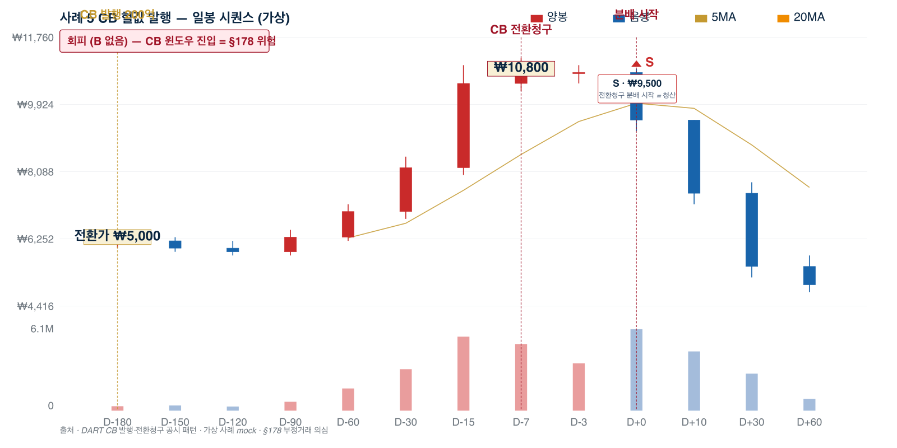

일봉 시퀀스 — D-180 CB 발행 ~ D+60 종가=전환가 (가상 사례 mock · §178 부정거래 의심)

<h3>세력 전략</h3>

㈜D 시총 800억. ㈜S캐피탈이 CB 200억 인수 = 시총 25% 확보. 전환가 5,000원 / 현재가 6,200원 = 미실현 차익 +24% 즉시 구조 → D+30 분배 +280억 / §443 7년+

<h3>매매자 동행</h3>

CB 발행 공시 30일 윈도우 = 진입 차단. 본주식 매집 단계 (CB 공시 30일 외) + 거래대금 ×2 + 1분봉 RSI 30 + MA20 터치 = 분단위 스캘핑 후보 (시드 10%)

---

<!-- _class: case -->

CASE 05 · 분석
Continued from p.13

Mechanism
§178 + §176
Seed → Profit
200억 → 600억+
Window
CB 발행 30일 진입 차단

# 10 변칙 + 30일 윈도우 + 5.X 리픽싱

## 전환가 시가 -19% → D-7 전환청구 → 30일 분배

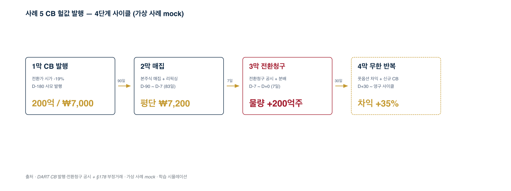

<table style="width:100%; border-collapse: collapse; margin-top: 8px; font-size: 16px;">
<thead><tr style="border-bottom: 1.5px solid #0A2540;"><th style="text-align:left; padding: 6px 8px;">단계</th><th style="text-align:left; padding: 6px 8px;">핵심 변칙</th><th style="text-align:left; padding: 6px 8px;">정량</th></tr></thead>
<tbody>
<tr style="border-bottom: 1px solid #DEE2E6;"><td style="padding: 4px 8px;"><strong>1막 발행</strong></td><td style="padding: 4px 8px;">전환가 시가 -19%</td><td style="padding: 4px 8px;">200억 / ₩7,000 / D-180</td></tr>
<tr style="border-bottom: 1px solid #DEE2E6;"><td style="padding: 4px 8px;"><strong>2막 매집</strong></td><td style="padding: 4px 8px;">본주식 매집 + 풍문</td><td style="padding: 4px 8px;">평단 ₩7,200 / 83일</td></tr>
<tr style="border-bottom: 1px solid #DEE2E6;"><td style="padding: 4px 8px;"><strong>3막 청구</strong></td><td style="padding: 4px 8px;">DART 전환청구 + 분배</td><td style="padding: 4px 8px;">물량 +200억주 / 30일</td></tr>
<tr><td style="padding: 4px 8px;"><strong>4막 사이클</strong></td><td style="padding: 4px 8px;">풋옵션 + 신규 CB</td><td style="padding: 4px 8px;">차익 +35% / 무한</td></tr>
</tbody>
</table>

진입 차단 게이트 = CB 발행 30일 윈도우 + 전환청구 공시 = §178 부정거래 직격 · 가상 사례 mock

---

<!-- _class: case -->

CASE 5.X
작전주 12 사례 (고급)

Mechanism
리픽싱 + 풋옵션 무한 사이클
Timeline
D-180 ~ D+30 (×N)
Statute
11원칙 §7 직격 + 풋옵션 풍문

# 리픽싱 + 풋옵션 사이클

## 본주식 분배 + 풋옵션 차익 + 신규 CB 인수 무한 반복

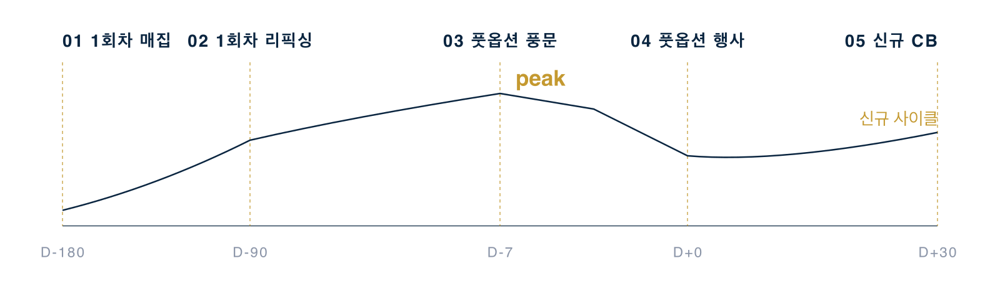

출처 · 리픽싱 한도 70% + 풋옵션 + 신규 CB 무한 사이클 (가상 사례)

<h3>세력 전략</h3>

리픽싱 한도 70% (공격적). 1회차 리픽싱 후 부양 + 2회차 리픽싱 + 풋옵션 D-7 카페 풍문 ("사채 상환 호재") + 풋옵션 행사 + 신규 CB 인수 = 무한 사이클 함정

<h3>매매자 동행</h3>

신규 CB 발행 공시 = 새 사이클 매집 시작 = 다시 30일 회피. 풋옵션 D-7 카페 풍문 = 진입 금지. 리픽싱 한도 70% = -10 페널티 + 30일 회피. 다음 사이클 진입 0%

---

<!-- _class: case -->

CASE 06
작전주 12 사례

Mechanism
무자본 M&amp;A + 자산 횡령
Timeline
D-90 ~ D+60
Statute
자본시장법 §178 + 특경법 사기죄

# 회사 돈으로 회사 사기

## 자기자본 0 인수 + 신사업 공시 + 자산 노출

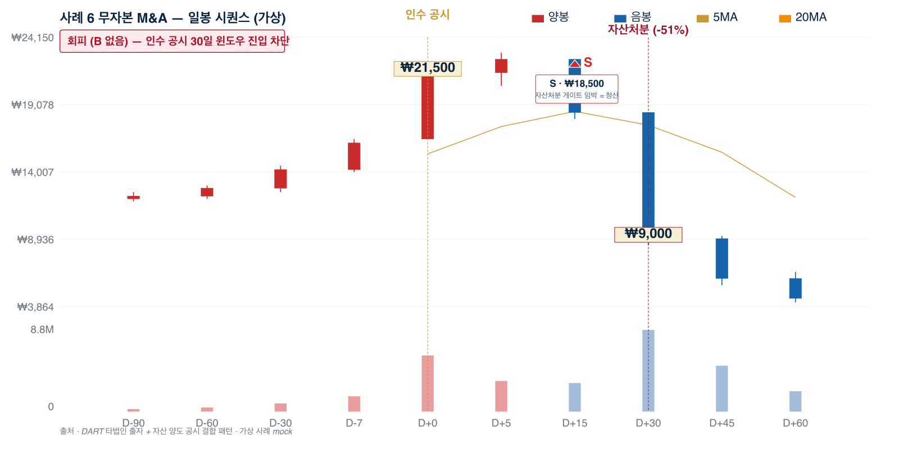

일봉 시퀀스 — D+0 인수 공시 +30% → D+30 자산처분 공시 -51% (가상 사례 mock · 무자본 확정 게이트)

<h3>세력 전략</h3>

㈜H (자기자본 0, 사채 500억)가 ㈜M (시총 800억, 자산 600억) 50% 프리미엄 인수 → "신사업 진출" 공시 → D-3 제3자배정 → D+0 분배 → 차익 +800억 / 1심 8년

<h3>매매자 동행</h3>

인수자 설립 1년 미만 = 게이트 차단. DART 자산 처분 공시 30일 = 즉시 청산. 분기 자산 -50% = 즉시 시장가 청산. 거래대금 ×3 = 눌림 + 손절 -3% 한정 진입

---

<!-- _class: case -->

CASE 06 · 분석
Continued from p.16

Mechanism
§178 + §443
Pattern
인수 후 30일 자산처분
Trigger
DART 타법인 출자 + 자산 양도

# 9 변칙 + 30일 자산처분 트리거

## 자기자본 0 + 회사 자산 500억 = 무자본 확정

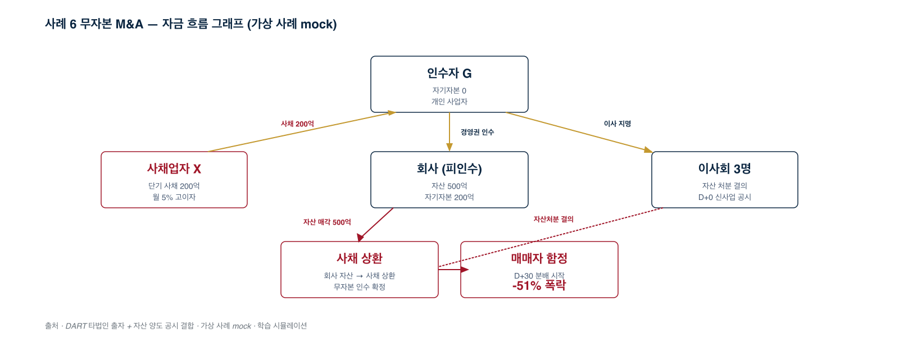

<table style="width:100%; border-collapse: collapse; margin-top: 8px; font-size: 16px;">
<thead><tr style="border-bottom: 1.5px solid #0A2540;"><th style="text-align:left; padding: 6px 8px;">행위주체</th><th style="text-align:left; padding: 6px 8px;">행위</th><th style="text-align:left; padding: 6px 8px;">정량</th></tr></thead>
<tbody>
<tr style="border-bottom: 1px solid #DEE2E6;"><td style="padding: 4px 8px;"><strong>인수자 G</strong></td><td style="padding: 4px 8px;">자기자본 0 인수</td><td style="padding: 4px 8px;">사채 200억 차입</td></tr>
<tr style="border-bottom: 1px solid #DEE2E6;"><td style="padding: 4px 8px;"><strong>이사회 3명</strong></td><td style="padding: 4px 8px;">D+0 자산처분 결의</td><td style="padding: 4px 8px;">신사업 공시 위장</td></tr>
<tr style="border-bottom: 1px solid #DEE2E6;"><td style="padding: 4px 8px;"><strong>회사 자산</strong></td><td style="padding: 4px 8px;">D+30 자산 매각</td><td style="padding: 4px 8px;">500억 → 사채 상환</td></tr>
<tr><td style="padding: 4px 8px;"><strong>매매자</strong></td><td style="padding: 4px 8px;">D+30 분배 시작</td><td style="padding: 4px 8px;">-51% 폭락</td></tr>
</tbody>
</table>

진입 차단 게이트 = 인수 공시 후 30일 윈도우 + 자산처분 결합 패턴 = §178 부정거래 직격 · 가상 사례 mock

---

<!-- _class: case -->

CASE 06 · 동행
Continued from p.17

진입 차단
인수 공시 후 30일
즉시 청산
자산 양도 공시
비중
5% (G2 기준)

# 30일 윈도우 = 진입 차단 게이트

## DART 결합 패턴 + 영구 차단

<h3>세력 전략 (G)</h3>

인수 공시 = 호재 인식 유발 → 분배 출구 형성. 인수 후 30일 자산처분 = 무자본 확정 (사채 상환 자금 회사 자산). 시장 인지 늦음 → -51% 폭락까지 매매자 함정. 이사회 우호 3명 결의 통과 = 합법 외피.

<h3>매매자 동행 (PM320)</h3>

<strong>진입 차단</strong>: 인수 공시 후 30일 윈도우 = 게이트 차단 (-15 페널티). <strong>즉시 청산</strong>: 인수 후 30일 이내 회사 자산 처분·대여 공시 = 무자본 확정 → 시장가. <strong>비중 5%</strong>: G2 기준 무자본 의심 종목 보수적.

<blockquote style="margin-top: 16px; border-left: 3px solid #C49930; padding-left: 16px;">
<strong>매매 원칙</strong>: DART "타법인 출자" + 30일 후 "자산 양도" 결합 = 영구 차단. 인수자 설립 1년 미만 = 게이트 차단. 본 자료의 모든 가격·거래량·인물은 학습 목적 가상 시뮬레이션
</blockquote>

자본시장법 §178 부정거래 + §443 가중처벌 (5년 / 부당이득 3~5배) · 특경법 사기죄 결합 영역

---

<!-- _class: case -->

CASE 07
작전주 12 사례

Mechanism
CFD 익명 5배 레버리지
Timeline
D-730 ~ D+1
Statute
2023 SG증권 사태 §443 가중처벌

# 익명 레버리지 매집

## 2~3년 잠복 매집 + 마진콜 + 8종목 동시 하한가

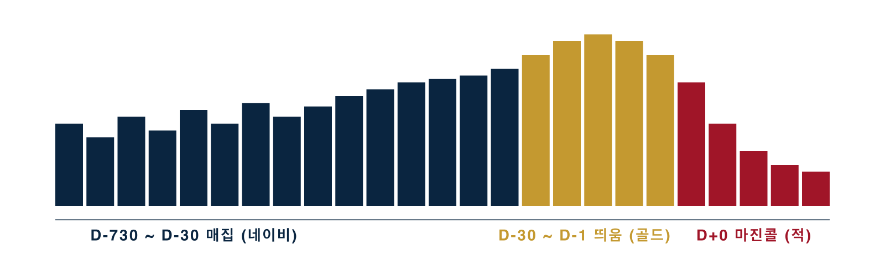

출처 · CFD 5배 레버리지 분배 — 2023 SG증권 사태 패턴 (가상 사례)

<h3>세력 전략</h3>

CFD 익명성 + 5배 레버리지로 2~3년 잠복 매집. 자기자본 1,000억 → 5,000억 포지션 → 마진콜 발동 시 8종목 동시 -30% 하한가 → 신용 매수 매매자 강제 청산

<h3>매매자 동행</h3>

외국계 창구 30% 이상 = 진입 금지. 8종목 동시 -10% = 즉시 청산. G3 미만 절대 진입 X. CFD 비중 10% 미만 + 그룹 동조성 5% 미만 동시 충족 시에만 (시드 3% 한정)

---

<!-- _class: case -->

CASE 08
작전주 12 사례

Mechanism
사모펀드 NAV 부풀리기
Timeline
D-365 ~ D+30
Statute
라임형 환매 중단 청산

# "사모 = 안전" 환상

## NAV 부풀리기 + 환매 요청 폭증 + 청산 매도 폭격

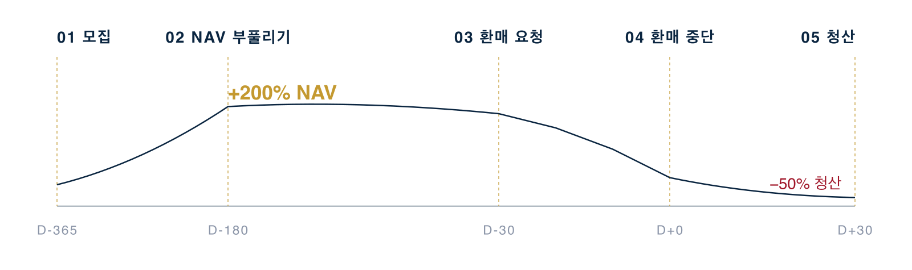

출처 · 라임형 사모펀드 환매 중단 청산 (가상 사례)

<h3>세력 전략</h3>

"사모 = 안전" 마케팅으로 1조원 모집 → 부실자산 +200% 매입 NAV 부풀리기 → 환매 요청 폭증 → 환매 중단 D+0 → 펀드 청산 매도 폭격 → -50% 폭락 영구 손실

<h3>매매자 동행</h3>

사모펀드 시총 5%+ 보유 = 진입 금지. DART 환매 중단 공시 = 즉시 청산 + 영구 차단. 환매 이슈 0건 + 거래대금 200억 이상 동시 충족 시에만 후보 (시드 5%)

---

<!-- _class: case -->

CASE 09
작전주 12 사례

Mechanism
임상 미공개 친인척 5명
Timeline
D-90 ~ D+30
Statute
자본시장법 §174 미공개정보 이용

# 임상 종료 ~ 공시 윈도우

## 친인척 5명 사전 인지 + 풍문 거래대금 ×14

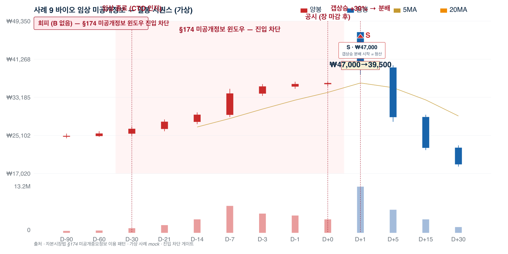

일봉 시퀀스 — D-30 임상 종료 ~ D+0 결과 공시 (가상 사례 mock · §174 윈도우 진입 차단)

<h3>세력 전략</h3>

㈜P 시총 5,000억. CTO 사전 인지 + 친인척 5명 D-30 매집 760억 → D-7 풍문 거래대금 ×14 → D+0 16:30 임상 결과 공시 → D+1 분배 → 차익 +1,500억 / §174 + §443

<h3>매매자 동행</h3>

임상 종료~공시 윈도우 = 진입 금지 (-15 페널티). 임상 결과 공시 16:00~17:30 + 익일 갭상승 +20% 이상 = 진입 금지. §174 미공개정보 가담 위험 회피

---

<!-- _class: case -->

CASE 09 · 분석
Continued from p.20

Mechanism
§174 + §443
Window
D-30 ~ D+0 (30일)
Subjects
CTO + 친인척 5

# 10 변칙 + §174 윈도우 거래대금 ×5

## CTO 인지 → 친인척 5명 매수 → §174 윈도우 30일

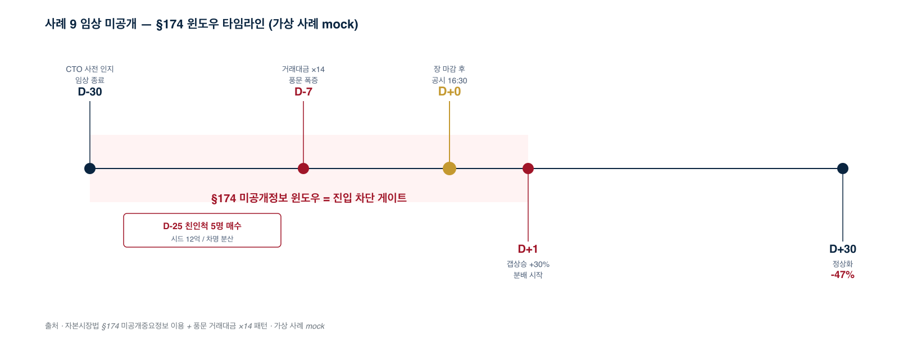

<table style="width:100%; border-collapse: collapse; margin-top: 8px; font-size: 16px;">
<thead><tr style="border-bottom: 1.5px solid #0A2540;"><th style="text-align:left; padding: 6px 8px;">시점</th><th style="text-align:left; padding: 6px 8px;">이벤트</th><th style="text-align:left; padding: 6px 8px;">정량</th></tr></thead>
<tbody>
<tr style="border-bottom: 1px solid #DEE2E6;"><td style="padding: 4px 8px;"><strong>D-30 임상 종료</strong></td><td style="padding: 4px 8px;">CTO 사전 인지</td><td style="padding: 4px 8px;">친인척 5명 매수 시작</td></tr>
<tr style="border-bottom: 1px solid #DEE2E6;"><td style="padding: 4px 8px;"><strong>D-7 풍문 폭증</strong></td><td style="padding: 4px 8px;">카페·텔레그램 게시</td><td style="padding: 4px 8px;">거래대금 ×14</td></tr>
<tr style="border-bottom: 1px solid #DEE2E6;"><td style="padding: 4px 8px;"><strong>D+0 16:30</strong></td><td style="padding: 4px 8px;">장 마감 후 공시</td><td style="padding: 4px 8px;">익일 갭상승 +30%</td></tr>
<tr><td style="padding: 4px 8px;"><strong>D+30 정상화</strong></td><td style="padding: 4px 8px;">분배 종료</td><td style="padding: 4px 8px;">-47% 폭락</td></tr>
</tbody>
</table>

진입 차단 게이트 = §174 미공개정보 윈도우 30일 = 본인 §174 가담 위험 · 가상 사례 mock · 학습 시뮬레이션

---

<!-- _class: case -->

CASE 09 · 동행
Continued from p.21

진입 차단
§174 윈도우 30일
페널티
거래대금 ×5 → -15
진입 가능
D+30 후 (윈도우 외)

# §174 윈도우 = 진입 금지

## 본인 §174 가담 위험 + 학습 시뮬레이션

<h3>세력 전략 (CTO 가족)</h3>

CTO 미공개정보 인지 → 친인척 매수 (D-30~D-7). 풍문 송출 → 추격매수 → 분배 (D-7~D+0). 장 마감 후 공시 → 익일 갭상승 +30% 분배 (D+1). 친인척 차명계좌 분배 → 사후 적발 (1년 후행).

<h3>매매자 동행 (PM320)</h3>

<strong>진입 차단</strong>: 임상 종료 ~ 공시 윈도우 = §174 윈도우 = 게이트 차단. <strong>거래대금 ×5 페널티</strong>: 윈도우 평소 ×5 → -15. <strong>공시 직후 30분 매도 폭증</strong>: 분봉 음봉 거래량 ×10 = 분배 = 청산만. <strong>D+30 후</strong>: 윈도우 외 + 친인척 매수 공시 0건 = 진입 가능.

<blockquote style="margin-top: 16px; border-left: 3px solid #C49930; padding-left: 16px;">
<strong>§174 위험</strong>: 임상 종료~공시 윈도우 진입 = 본인 §174 위반 가담 위험. 학습 시뮬레이션 ≠ 실거래. 본 자료의 모든 가격·거래량·인물은 학습 목적 가상 시뮬레이션
</blockquote>

자본시장법 §174 미공개중요정보 이용 + §443 가중처벌. 본 case는 학습 시뮬레이션 (LEGAL P0-4 marker)

---

<!-- _class: case -->

CASE 10
작전주 12 사례

Mechanism
테마 그룹 5종목 동시
Timeline
D-60 ~ D+5
Statute
통합 마케팅 + 대장 분배

# 테마 5종목 동시 부양

## 거래대금 1등 대장 + 2~3등 매물 + 동시 사망 시퀀스

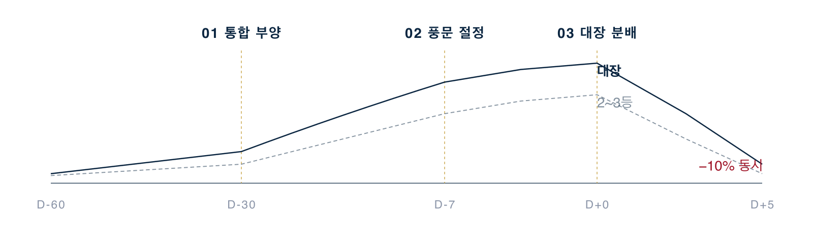

출처 · 테마 5종목 통합 마케팅 + 대장 분배 (가상 사례)

<h3>세력 전략</h3>

테마 5종목+ 매집 + 통합 마케팅 동시 부양 → 대장 분배 → 2~3등 매물 → 동시 -10% 사망 시퀀스. 매매자가 2등·3등 진입 시 대장 분배 매물 따라 가격 동조 폭락

<h3>매매자 동행</h3>

거래대금 1등 (대장)만 진입 (시드 10%, 가장 안정적). 진입 조건: 대장 + 거래대금 300억 + 1분봉 RSI 30 + 5종목 동시 폭증 단계 아님. 5종목 -10% = 즉시 청산

---

<!-- _class: case -->

CASE 11
작전주 12 사례

Mechanism
회계감사 의견거절
Timeline
D-180 ~ D+90
Statute
자본시장법 §174 사전 통보 분배 의심

# 재무제표 신뢰 붕괴

## 매출 위장 + 사전 통보 분배 + 의견거절 + 거래정지

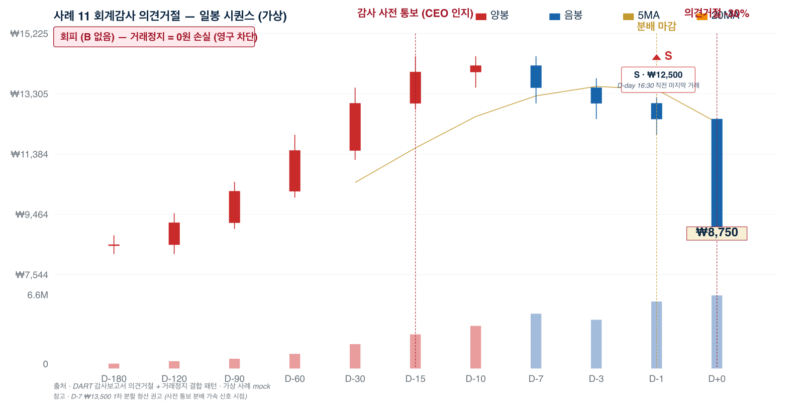

일봉 시퀀스 — D-180 매출 위장 → D-15 사전 통보 → D+0 의견거절 → 거래정지 (가상 사례 mock)

<h3>세력 전략</h3>

㈜U: CEO+CFO 합의로 매출 +52% 위장 (관계회사 거짓 매출 100억). 차명 12계좌 D-180~D-90 매집. D-15 외부 감사인 의견거절 통보 → CEO 사전 인지 → 차명 분할매도 → CEO 7년

<h3>매매자 동행 (회피만)</h3>

관계회사 매출 30% 이상 (-15) / 재고회전율 악화 (-10) / 감사인 변경 1년 + 매출 +50% YoY (-20) / 한정·의견거절·부적정 = 진입 차단. 시드 0% — 영구 회피

---

<!-- _class: case -->

CASE 11 · 분석
Continued from p.23

Mechanism
§174 사전 통보 + DART
Outcome
거래정지 + 상장폐지
Window
D-15 ~ D+0 (15일)

# 8 변칙 + 사전 통보 분배 + 거래정지

## D-15 사전 통보 → D+0 의견거절 → 거래정지 영구

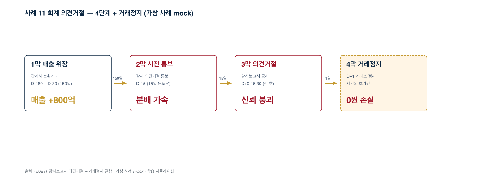

<table style="width:100%; border-collapse: collapse; margin-top: 8px; font-size: 16px;">
<thead><tr style="border-bottom: 1.5px solid #0A2540;"><th style="text-align:left; padding: 6px 8px;">단계</th><th style="text-align:left; padding: 6px 8px;">핵심 변칙</th><th style="text-align:left; padding: 6px 8px;">정량</th></tr></thead>
<tbody>
<tr style="border-bottom: 1px solid #DEE2E6;"><td style="padding: 4px 8px;"><strong>1막 매출 위장</strong></td><td style="padding: 4px 8px;">관계사 순환거래</td><td style="padding: 4px 8px;">매출 +800억 / 150일</td></tr>
<tr style="border-bottom: 1px solid #DEE2E6;"><td style="padding: 4px 8px;"><strong>2막 사전 통보</strong></td><td style="padding: 4px 8px;">감사 의견거절 통보</td><td style="padding: 4px 8px;">CEO 분할매도 / 15일</td></tr>
<tr style="border-bottom: 1px solid #DEE2E6;"><td style="padding: 4px 8px;"><strong>3막 의견거절</strong></td><td style="padding: 4px 8px;">감사보고서 D-day 공시</td><td style="padding: 4px 8px;">D+0 16:30 신뢰 붕괴</td></tr>
<tr><td style="padding: 4px 8px;"><strong>4막 거래정지</strong></td><td style="padding: 4px 8px;">D+1 거래소 정지</td><td style="padding: 4px 8px;">0원 손실 (영구 차단)</td></tr>
</tbody>
</table>

진입 차단 게이트 = 감사 의견 한정·의견거절·부적정 = 영구 차단 + 거래정지 = 시간외 호가만 · 가상 사례 mock · 학습 시뮬레이션

---

<!-- _class: case -->

CASE 11 · 동행
Continued from p.24

영구 차단
한정·의견거절·부적정
즉시 청산
D+0 공시 직후
손실
0원 (거래정지)

# 감사 의견 = 영구 차단 게이트

## 거래정지 = 0원 손실 + 시간외 호가만

<h3>세력 전략 (CEO U)</h3>

D-180 매출 위장 + 매집 (정상 호재 인식 유도). D-15 감사 사전 통보 → 분할매도 (15일 윈도우, 일반 매매자 인지 0). D+0 16:30 의견거절 공시 직전 분배 마감. D+1 거래정지 시작 = 일반 매매자 영구 손실.

<h3>매매자 동행 (PM320)</h3>

<strong>영구 차단</strong>: DART 감사 의견 "한정/의견거절/부적정/계속기업 불확실" → 진입 차단 게이트 + 영구 차단. <strong>즉시 청산</strong>: D+0 의견거절 공시 직후 = 익일 거래정지 확정 → 시장가 청산 (시간외 호가 활용). <strong>사전 신호</strong>: 감사 보고서 D-day 16:30 직전 거래량 폭증 = 사전 통보 분배 의심.

<blockquote style="margin-top: 16px; border-left: 3px solid #C49930; padding-left: 16px;">
<strong>거래정지 = 0원 손실</strong>: 의견거절 공시 후 즉시 청산 못하면 영구 손실. 관계회사 매출 30%+ + 재고회전율 악화 + 감사인 변경 1년 + 매출 +50% YoY = 영구 회피. 본 자료의 모든 가격·거래량·인물은 학습 목적 가상 시뮬레이션
</blockquote>

자본시장법 §174 사전 통보 분배 의심 + DART 감사보고서 + 한국거래소 거래정지. 본 case는 학습 시뮬레이션 (LEGAL P0-4 marker)

---

<!-- _class: divider -->
<!-- _paginate: true -->

02

Part

# 기관·연기금도 세력이다

## 합법적 대량 물량 분배 7 메커니즘

VWAP / TWAP · 블록딜 · 다크풀 · 시간외 · 분산 · 패시브 · 외인 BU/SE

<blockquote>작전주는 적발 대상, 기관·연기금은 합법. 단 시장 영향은 동등. 패턴 추적 → 동행 진입.</blockquote>

---

<!-- _class: case -->

I-1
기관·연기금 7 사례

Instrument
VWAP / TWAP 분할 매도 알고리즘
Timeline
D-day 14:00~15:30
Effect
평균 -0.17% 슬리피지 마감 35% 가속

# 알고리즘 시간표

## 거래량 가중평균 또는 시간 균등 분할 분배

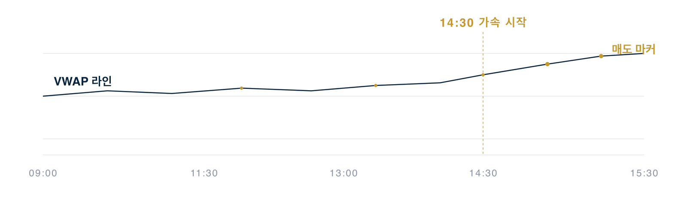

출처 · VWAP 라인 + 분할 매도 마커 — 13구간 분산

<h3>세력 전략</h3>

㈜AM 자산운용 LP 환매 200억 대응 → ㈜X 50만주 13구간 분할 매도. 평균 청산가 = VWAP -0.17% 슬리피지. 14:00~15:30 마감 가속 비중 35%.

<h3>매매자 동행</h3>

D-day 14:30~15:30 VWAP 라인 하향 이탈 + RSI 35 + 거래량 ×1.5 → 시드 5%. D+1 09:00~09:30 갭다운 -0.5~-1% + 양봉 전환 → 시드 7% (단기 반등).

---

<!-- _class: case -->

I-2
기관·연기금 7 사례

Instrument
블록딜 (Block Trading)
Timeline
D-1 종가 ~ D+5
Effect
시장가 -3~10% 디스카운트 익일 09:00 공시

# 장 마감 후 대량 매매

## 시장가 디스카운트 + 익영업일 09:00 공시 + D+5 회복

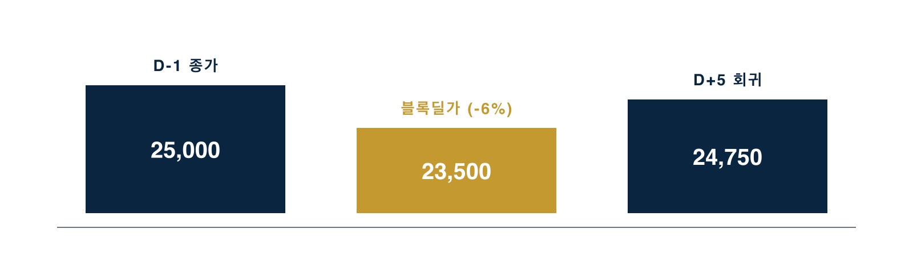

출처 · 블록딜 디스카운트 → 회귀 — 200만주 470억 (가상 사례)

<h3>세력 전략</h3>

㈜PE 사모펀드 → ㈜PE2 ㈜Y 200만주 인수 = 23,500원 (-6% 디스카운트), 470억. D+1 시초가 -7.2% 갭다운 → -8.8% 저점 → D+5 종가 회귀.

<h3>매매자 동행</h3>

D+1 09:00~09:30 시초가 -5% 하향 + RSI 30 + 5호가 매수 잔량 두께 ↑ → 시드 7% (1~3일 회복 노림). 목표가 = D-day 종가 95~98%.

---

<!-- _class: case -->

I-3
기관·연기금 7 사례

Instrument
다크풀 / 익명 ATS
Timeline
D-day 거래시간 외
Effect
호가창 노출 0 거래량-시세 갭

# 호가창 노출 0

## 거래소 외 익명 매칭 + 호가창 거래량 vs 시세 갭

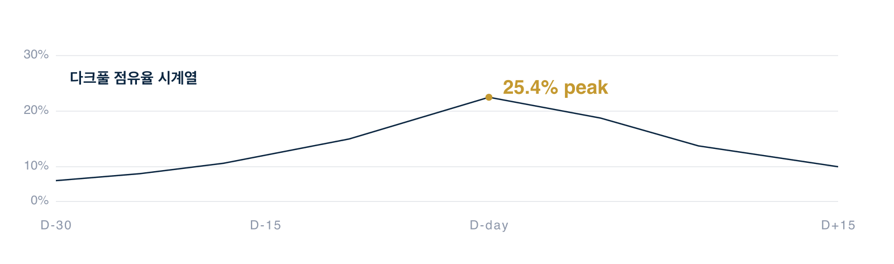

출처 · NYSE 다크풀 점유율 % — ADR 종목 한국 호가창 노출 0

<h3>세력 전략</h3>

㈜FF 외국계 운용사 ㈜Z (코스피·NYSE ADR) 1,000만주 청산 = NYSE 다크풀 익명 매도. 한국 호가창 노출 0 + 한국 종가 -2~-3% (외국인 SE 결합).

<h3>매매자 동행</h3>

호가창 거래량 vs 실제 시세 변동 갭 = 다크풀 의심. D+1 09:00~09:30 매도 종료 후 갭상승 + BU 전환 → 시드 5% (반등). ADR 종목 (삼성·SK·NAVER) 호가창만 = 함정.

---

<!-- _class: case -->

I-4
기관·연기금 7 사례

Instrument
시간외 단일가
Timeline
16:00 ~ 18:00 (12구간)
Effect
정규장 종가 +3.2% 익일 갭상승 신호

# 장 마감 후 30분 + 90분

## 16:00~18:00 12구간 단일가 매매 + 결정가 갭

출처 · 시간외 단일가 12구간 결정가 vs 정규장 종가 (가상 사례)

<h3>세력 전략</h3>

㈜PEN 연기금 분기 리밸런싱 ㈜W 50만주 매수 = 정규장 호가 노출 회피. 시간외 16:00~18:00 12구간 분산 = 평균 25,800원 (정규장 종가 +3.2%).

<h3>매매자 동행</h3>

D-day 16:00~16:30 시간외 단일가 +3% 결정가 → D+1 시초가 갭상승 가능성 → 시드 5%. D+1 09:00 갭상승 +1~2% → 09:30 익절 → 시드 7%.

---

<!-- _class: case -->

I-5
기관·연기금 7 사례

Instrument
분산 분배 (Iceberg)
Timeline
D-day 09:00 ~ 15:30
Effect
100주 ×3,000건 빙산 -0.6% 슬리피지

# 장중 흩뿌리기

## 1만주 → 100주 ×100건 빙산주문 + 분 단위 분포

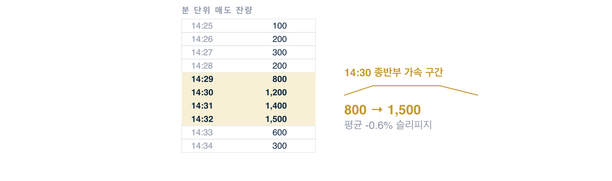

출처 · 빙산주문 분 단위 매도 잔량 분포 (가상 사례)

<h3>세력 전략</h3>

㈜AM2 자산운용 ㈜V 30만주 청산 = 100주 ×3,000건/일 빙산주문. 매분 7~8건 ×100주. 평균 매도가 -0.6% 슬리피지. 14:30 종반부 가속.

<h3>매매자 동행</h3>

D-day 14:30 이후 종반부 가속 + RSI 30 + 5호가 매수 두께 ↑ → 시드 3% (보수적). D+1 09:00~10:30 분배 종료 + 거래량 ×1.5 + 양봉 → 시드 7%.

---

<!-- _class: case -->

I-6
기관·연기금 7 사례

Instrument
패시브 펀드 리밸런싱
Timeline
D-30 공지 ~ D+1
Effect
강제 매수 250억 D-day +7%

# 지수 편입·편출 강제

## KOSPI200 / MSCI Korea 정기 변경 + 동시호가 매수

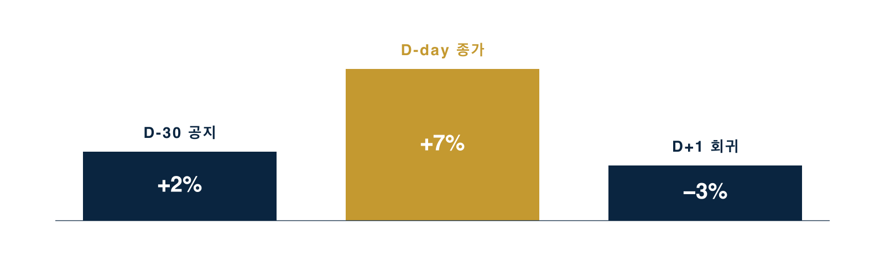

출처 · KOSPI200 신규 편입 — 패시브 펀드 250억 강제 매수 (가상 사례)

<h3>세력 전략</h3>

㈜EM KOSPI200 신규 편입 = 패시브 펀드 250억 강제 매수 (시총 비중 정합). D-30 공지 → 차익매수자 사전 매수 → D-day 종가 동시호가 강제 매수 = +7% → D+1 -3% 회귀.

<h3>매매자 동행</h3>

D-30 공지 직후 신규 편입 + 매수 예상액 / 5일 = 일평균 거래대금 → 시드 10% (21일 보유). D-day 14:30~15:25 동시호가 직전 거래량 ×5+ → 시드 15% (종가 직전 청산).

---

<!-- _class: case -->

I-7
기관·연기금 7 사례

Instrument
외국인 BU/SE 창구 매매
Timeline
D-day ~ D+5
Effect
5일 누적 +5% 창구별 BU 추적

# Buy-Sell 차감 매매

## 한국 지점 창구별 5일 누적 패턴 추적

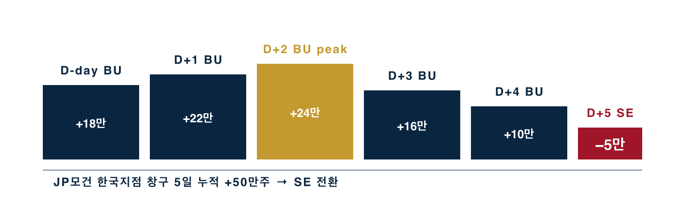

출처 · 외국인 BU/SE 창구별 일별 잔량 — 5일 동행 시그널 (가상 사례)

<h3>세력 전략</h3>

JP모건 한국지점 ㈜FOR 100만주 분산 매수 = 일평균 거래대금 200억 → 5일 ×20만주. 누적 +5%. D+5 매수 종료 → 횡보 → D+6 익절 또는 보유.

<h3>매매자 동행</h3>

D+1 또는 D+2 JP모건 BU 2~3일 연속 매수 확인 (거래소 D+1 16:00 발표) + 누적 +50만주+ + RSI 40 → 시드 10% (5일 동행 익절). SE 우위 전환 = 즉시 청산.

---

<!-- _class: case -->
<!-- _paginate: true -->

24
Appendix

자본시장법
§ 174 미공개정보 § 176 시세조종 § 178 부정거래 § 443 가중처벌
Disclaimer
외부 유포 금지 비공개 연구자료

# LEGAL · DISCLAIMER

## 자본시장법 §174 / §176 / §178 + §443 가중처벌

| 법령 | 행위 | 처벌 수준 |
|---|---|---|
| § 174 | 미공개 중요정보 이용 | 1년+ / 부당이득 3~5배 |
| § 176-1 | 통정매매 (시세조종) | 1년+ / 부당이득 3~5배 |
| § 176-2 | 가장매매 (시세조종) | 1년+ / 부당이득 3~5배 |
| § 178 | 사기적 부정거래 | 1년+ / 부당이득 3~5배 |
| § 443 | 가중처벌 (부당이득 50억+) | 무기 또는 5년+ |

본 자료의 법적 인용·주식 매매·세력 분석은 <strong>교육 목적</strong>이며, 특정 종목 매매 권유가 아닙니다. 모든 종목명·회사명·인명은 가상이며, 본 자료를 근거로 한 투자 결정의 책임은 투자자 본인에게 있습니다.

의심 사례 신고 · 한국거래소 1577-0088 · 금감원 1332

---

<!-- _class: lead -->
<!-- _paginate: false -->

# Far. One Step.

## 멀리, 한 걸음.

100M1S · RESEARCH · 2026-05

© 2026 100M1S · 비공개 연구자료 · 외부 유포 금지

<!-- ================================================================================ -->
<!-- LEGAL P0-4 EXCLUDE BLOCK — source-only mirror (slide 본문 인용 0건)              -->
<!-- 9쌍 marker 본문 source 보존 (정합 주석).                                          -->
<!-- 빌드 시 marker 사이 콘텐츠 sed 사전 제거 (Marp .pptx/.pdf/.html 모두 인용 0건).   -->
<!-- 명령: sed -e '/LEGAL_P0_4_EXCL_START/,/LEGAL_P0_4_EXCL_END/d' (실제 패턴은 hyphen) -->
<!-- ================================================================================ -->

[case 3 — 텔레그램·카페 알바 풍문 작전]
<!-- LEGAL-P0-4-EXCLUDE-START -->
### 매매자 동행 가이드

- **회피·관찰 우선**: 풍문 단계 (D-15 ~ D-7) 카페 게시 ≥ 평소 ×15 + 작성자 다양성 5명 미만 = **풍문 작전 의심 윈도우 → 진입 금지**
- 진입 검증 조건: 작성자 다양성 ≥ 10명 + 후속 검증 가능 IR 출처 + 거래대금 ≥ 200억 + 1분봉 RSI ≤ 30 동시 충족
- 강제 청산: "MOU/양해각서/추후 협의/구속력 없음" 키워드 공시 발견 즉시
- 비중: 시드 3% (풍문 작전 의심 종목 보수적)
<!-- LEGAL-P0-4-EXCLUDE-END -->

[case 4 — 허위공시 작전]
<!-- LEGAL-P0-4-EXCLUDE-START -->
### 매매자 동행 가이드

- **회피·관찰 우선**: 풍문 단계 (D-15 ~ D-7) 거래대금 ≥ 200억 + 본 계약 키워드 공시 0건 = **작전 의심 윈도우 → 진입 금지**
- 진입 검증 조건: 거래대금 ≥ 200억 + 1분봉 RSI ≤ 30 + MA10 터치 + 미공개정보 누출 신호 부재 (친인척 매수 공시 0건 + 공시 직전 거래량 평소 ×3 미만) 동시 충족
- 강제 청산: "MOU/양해각서/검토중" 키워드 공시 발견 즉시
- 비중: 시드 5% (허위공시 위험)
<!-- LEGAL-P0-4-EXCLUDE-END -->

[case 5 — CB/BW 헐값 발행]
<!-- LEGAL-P0-4-EXCLUDE-START -->
### 매매자 동행 가이드
- 진입 조건: 거래대금 ≥ 평소 ×2 + 1분봉 RSI ≤ 30 + 종가 = MA20 ±1% + CB 공시 30일 외
- 청산 조건: 익절 = 직전 5일 고점 / 손절 = 진입가 -3% / 강제 청산 = 전환청구 공시 즉시
- 비중: 시드 10%
<!-- LEGAL-P0-4-EXCLUDE-END -->

[case 6 — 무자본 M&A]
<!-- LEGAL-P0-4-EXCLUDE-START -->
### 매매자 동행 가이드
- 진입 조건: 거래대금 ≥ 평소 ×3 + 1분봉 RSI ≤ 30 + 인수자 자금 출처 명확 + 인수 후 30일 경과
- 청산 조건: 익절 = +5% / 손절 = -3% / 강제 청산 = 자산 처분 공시 즉시
- 비중: 시드 5% (무자본 M&A 의심 종목 보수적)
<!-- LEGAL-P0-4-EXCLUDE-END -->

[case 7 — CFD SG증권형]
<!-- LEGAL-P0-4-EXCLUDE-START -->
### 매매자 동행 가이드
- 진입 조건: CFD 비중 < 10% + 그룹 동조성 < 5% + 거래대금 ≥ 200억 + 1분봉 RSI ≤ 30 (눌림목)
- 청산 조건: 익절 = +5% / 손절 = -3% / 강제 청산 = 동일 그룹 5종목+ 동시 -10% 시 즉시
- 비중: 시드 3% (CFD 청산 트리거 위험)
<!-- LEGAL-P0-4-EXCLUDE-END -->

[case 8 — 사모펀드 라임형]
<!-- LEGAL-P0-4-EXCLUDE-START -->
### 매매자 동행 가이드
- 진입 조건: 사모펀드 보유 < 5% + 환매 이슈 0건 + 거래대금 ≥ 200억
- 청산 조건: 익절 = +5% / 손절 = -3% / 강제 청산 = 펀드 환매 중단 공시 즉시
- 비중: 시드 5%
<!-- LEGAL-P0-4-EXCLUDE-END -->

[case 9 — 바이오 임상 미공개정보]
<!-- LEGAL-P0-4-EXCLUDE-START -->
### 매매자 동행 가이드 (임상 미공개정보 윈도우 외 한정)

- **회피·관찰 우선**: 임상 종료~공시 사이 D-30~D-day 윈도우 = **진입 금지**. 본 윈도우 거래대금 폭증 = §174 의심 신호 → 매매 가담 위험
- 진입 검증 조건 (윈도우 외 한정): 임상 결과 공시 후 D+30 이후 + 거래대금 ≥ 200억 + 1분봉 RSI ≤ 30 + 친인척 매수 공시 0건 + 후속 임상 실패 신호 부재 동시 충족
- 강제 청산: 임상 결과 공시 직전 일봉 윗꼬리 시 + 친인척 매수 공시 발견 즉시
- 비중: 시드 3% (바이오 변동성 위험)
<!-- LEGAL-P0-4-EXCLUDE-END -->

[case 10 — 테마 그룹 동시 작전]
<!-- LEGAL-P0-4-EXCLUDE-START -->
### 매매자 동행 가이드
- 진입 조건: 테마 대장(거래대금 1등) + 거래대금 ≥ 300억 + 1분봉 RSI ≤ 30 + 테마 5종목 동시 폭증 단계 아님
- 청산 조건: 익절 = +5% / 손절 = -3% / 강제 청산 = 테마 5종목 동시 -10% 시 즉시 (테마 사망)
- 비중: 시드 10% (대장만 진입 시 가장 안정적)
<!-- LEGAL-P0-4-EXCLUDE-END -->

[case 11 — 회계감사 의견거절·한정·강조사항]
<!-- LEGAL-P0-4-EXCLUDE-START -->
### 매매자 동행 가이드

- **회피·관찰 우선**: 감사 보고서 작성 단계 (D-15 ~ D-7) 거래대금 폭증 + 신용잔고 감소 = **사전 통보 분배 의심 윈도우 → 진입 금지**. 감사 의견거절 윈도우 사전 통보 분배 의심 = §174 미공개정보 가담 위험
- 진입 검증 조건: 감사 보고서 발표 후 **거래정지 해제 + 적정 의견 + 관계회사 매출 비중 < 20% + 재고회전율 정상화** 동시 충족
- 강제 청산: DART 감사 의견 "한정/의견거절/부적정/계속기업 불확실" 공시 발견 즉시
- 비중: 시드 0% — **재무제표 신뢰 붕괴 = 펀더멘털 자체 위험 = 영구 회피**
<!-- LEGAL-P0-4-EXCLUDE-END -->

<!-- ================================================================================ -->
<!-- END LEGAL P0-4 EXCLUDE BLOCK                                                     -->
<!-- ================================================================================ -->
